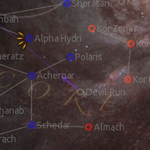
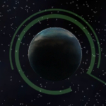
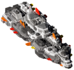

# **my endless-sky-plugins**
I aim at developing small, modular and maximal compatible plugins that don't break vanilla lore too much.  
Please excuse bad english, spelling, grammar, etc... english isn't my mother tongue. Feel free to correct me. 
<a href="https://github.com/zuckung/endless-sky-plugins/pulls">Pull requests</a>, <a href="https://github.com/zuckung/endless-sky-plugins/discussions">discussions</a> and <a href="https://github.com/zuckung/endless-sky-plugins/issues">Issue reports</a> are welcome!  
 
Furthermore i'd like to present <a href="https://zuckung.github.io/ES-DataParser/">https://zuckung.github.io/ES-DataParser/</a> to other plugin creators or people who seek informations inside the data folder. Basically it is a very fast website to view every object of the data folder, especially when you don't know where to find something. Easy browsing of missions, ships, outfits, systems etc. 
 

 

## Latest News:
<table><tr><td> 2024-06-07 | update: automata.destruction.0percent 
2024-06-07 | update: additional.command.buttons 
2024-05-28 | update: captureable.person.ships 
2024-05-27 | update: captureable.person.ships 
2024-05-26 | update: hai.side.mission.unlocker 
2024-05-26 | update: quarg.farm 
2024-05-26 | update: disable.spaceport.repeatables 
2024-05-14 | update: control.station 
2024-05-09 | update: control.station 
2024-05-09 | update: additional.command.buttons.radial 
 </td></tr></table>

## Plugin List: 
<table><tr valign="top"><td> 
<a href="README.md#additionalcommandbuttons">additional.command.buttons</a> 
<a href="README.md#additionalcommandbuttonsradial">additional.command.buttons.radial</a> 
<a href="README.md#automatadestruction0percent">automata.destruction.0percent</a> 
<a href="README.md#automatainhumanspace">automata.in.human.space</a> 
<a href="README.md#betterstarts">better.starts</a> 
<a href="README.md#bunrodeamissions">bunrodea.missions</a> 
<a href="README.md#captureablepersonships">captureable.person.ships</a> 
<a href="README.md#coalitionshopping">coalition.shopping</a> 
<a href="README.md#controlstation">control.station</a> 
<a href="README.md#devil-rununhidden">devil-run.unhidden</a> 
<a href="README.md#disablepersonships">disable.person.ships</a> 
 </td><td> 
<a href="README.md#disablespaceportrepeatables">disable.spaceport.repeatables</a> 
<a href="README.md#expertcrewmembers">expert.crew.members</a> 
<a href="README.md#freeworlds5yearslater">free.worlds.5.years.later</a> 
<a href="README.md#galacticcapitalinvestment">galactic.capital.investment</a> 
<a href="README.md#gegnopirates">gegno.pirates</a> 
<a href="README.md#haisidemissionunlocker">hai.side.mission.unlocker</a> 
<a href="README.md#korefretshipyard">kor.efret.shipyard</a> 
<a href="README.md#morearfectas">more.arfectas</a> 
<a href="README.md#moreboardingmissions">more.boarding.missions</a> 
<a href="README.md#navylicenses">navy.licenses</a> 
 </td><td> 
<a href="README.md#nomoremeretimines">no.more.mereti.mines</a> 
<a href="README.md#piratewarlords">pirate.warlords</a> 
<a href="README.md#planetmap">planet.map</a> 
<a href="README.md#quargfarm">quarg.farm</a> 
<a href="README.md#realfluff">real.fluff</a> 
<a href="README.md#showreputation">show.reputation</a> 
<a href="README.md#snowfeatherrobotics">snowfeather.robotics</a> 
<a href="README.md#spacefauna">space.fauna</a> 
<a href="README.md#toomanyasteroids">too.many.asteroids</a> 
<a href="README.md#uniquefix">unique.fix</a> 
 </td></tr></table>

---

### additional.command.buttons

[additional.command.buttons.zip](https://github.com/zuckung/endless-sky-plugins/releases/download/Latest/additional.command.buttons.zip) | 160.56 kb | 2024-06-07 | [view files](https://github.com/zuckung/endless-sky-plugins/tree/main/myplugins/additional.command.buttons/)  
 
>Made for the mobile version and adds several new buttons to the lower right corner. See the readme for details.
>(inspired by theweirednut)

:blue_book: Plugin readme

<blockquote>### additional.command.buttons  

 

Made for the mobile version and changes the interface by adding the following 10 buttons:   

<ul>

<li>full stop</li>

<li>board ship</li>

<li>land on planet</li>

<li>fleet: harvest flotsam</li>

<li>fleet: hold position</li>

<li>fleet: gather around me</li>

<li>fleet: attack my target</li>

<li>fleet: toggle ammo usage</li>

<li>view player info</li>

<li>fast forward</li>

</ul>

and

<ul>

<li>adjusts the message box to not overlap</li>

<li>moved the hidden ammo box to a visible place</li>

</ul>

 

(inspired by theweirednut)  

 

 

Allthough most of these commands are now implemented in other parts to the original mobile user interface or can be accessed by gestures, I personally prefer these buttons on the lower right corner. 

 

Additional there are some functions in this plugin that the original mobile ui can't do at the moment: 

- board button cycles through the possibilities  

- fleet commands can be used for single ships when selected  

 

This plugin overwrites `interface "main buttons"` and `interface "hud"`, so it isn't compatible with other plugins modifying these. 

 

 

Changelog: 

 

2024-06-07 

text corrections (thx to TheGiraffe3) 

 

2024-02-20 

re-added the ammo box to main buttons (latest mobile game version needed) 

 

2023-10-17 

added plugin.txt 

 

2023-08-24 

fixed non-firing attack button 

 

2023-08-05 

moved the hidden ammo box to a visible place 

 

2023-08-02 

added new icon and reworked readme 

 

2023-07-26 

added 3 more buttons to a total of 10 

added descriptions inside script to exchange buttons functions 

 

2023-07-06 

changed 'fire afterburner' to new 'fleet: harvest flotsam', because afterburner can easily toggled by double tapping 

</blockquote>

 

---

### additional.command.buttons.radial

[additional.command.buttons.radial.zip](https://github.com/zuckung/endless-sky-plugins/releases/download/Latest/additional.command.buttons.radial.zip) | 32.39 kb | 2024-05-09 | [view files](https://github.com/zuckung/endless-sky-plugins/tree/main/myplugins/additional.command.buttons.radial/)  
 
>Reworks the main buttons ui on the lower right side. Made for the mobile version. See the readme for details.

:blue_book: Plugin readme

<blockquote>### additional.command.buttons  

 

Reworks the main buttons ui on the lower right side. Made for the mobile version.  

 

 

This plugin rearranges and resizes some of the buttons, adds two easy accessible buttons and puts an image behind them. 

 

 

 

Changelog: 

 

2024-05-09 

initial release 
</blockquote>

 

---

### automata.destruction.0percent

[automata.destruction.0percent.zip](https://github.com/zuckung/endless-sky-plugins/releases/download/Latest/automata.destruction.0percent.zip) | 44.08 kb | 2024-06-07 | [view files](https://github.com/zuckung/endless-sky-plugins/tree/main/myplugins/automata.destruction.0percent/)  
 
>Modifies the self destruction chance of Sestor and Mereti ships to a value of 0.0 (0%). See the readme for details.

:blue_book: Plugin readme

<blockquote>### automata.destruction.0percent

 

 

Modifies the self destruction chance of Sestor and Mereti ships to a value of 0.0 (0%). 

 

Sestor 349/109/78/71/53/27/14 and Mereti 512/256/128/64/32/16/8 ships have a self destruction value of 0.0 (0%) now. 

You can easily change the values in automata.txt for each ship ('"self destruct" .0') to a value of your choice. I.e. 0.12 is 23%, 0.3 is 51%, 0.5 is 75%. Its calculated twice, first the chance for self destruction on boarding(i.e. 0.3) is 30%, then of the remaining 70% again 30% chance for self destruction on capturing. That makes 30% + 21% = 51% overall chance for self destruction on a capturing try. 

 

 

Changelog: 

 

2024-06-07 

text corrections (thx to TheGiraffe3) 

 

2023-10-17 

added plugin.txt 

 

2023-09-07 

changed icon 

changed about.txt 

changed readme 

</blockquote>

 

---

### automata.in.human.space

[automata.in.human.space.zip](https://github.com/zuckung/endless-sky-plugins/releases/download/Latest/automata.in.human.space.zip) | 35.74 kb | 2023-10-17 | [view files](https://github.com/zuckung/endless-sky-plugins/tree/main/myplugins/automata.in.human.space/)  
 
>Brings jump drive equipped automata into human space after the wanderer campaign. See the readme for details.

:blue_book: Plugin readme

<blockquote>### automata.in.human.space

 

 

Brings jump drive equipped automata into human space after the wanderer campaign.  

 

You can find them where Korath ships in human space are usually found(ember waste and eastern syndicate).  

The chance to encounter previous Korath ships or automata is like 50/50.  

 

 

Changelog: 

 

2023-10-17 

added plugin.txt 

 

2023-09-01 

added more fleet variants  

reworked readme  

changed icon.png 

</blockquote>

 

---

### better.starts

[better.starts.zip](https://github.com/zuckung/endless-sky-plugins/releases/download/Latest/better.starts.zip) | 22.34 kb | 2024-03-15 | [view files](https://github.com/zuckung/endless-sky-plugins/tree/main/myplugins/better.starts/)  
 
>Adds several new start options with different ships, background storys, credits and debts. See the readme for details.

:blue_book: Plugin readme

<blockquote>### better.starts  

 

Adds 9 new start options with different ships, background storys, credits and debts. 

 

<ul>

<li>Start: Trader | Freighter: equipped for cargo transport, in Merak system</li>

<li>Start: Trader (Hai) | Aphid: equipped for cargo transport, in Fah Soom system(Hai space)</li>

<li>Start: Passenger Transport | Scout: equipped for passenger transport, Talita system</li>

<li>Start: Miner | Sunder: equipped for mining, in Rasalhague system</li>

<li>Start: Salvager | Shuttle: equipped for boarding, in Aldhibain system</li>

<li>Start: Salvager(big) | Argosy: equipped for boarding, in Aldhibain system</li>

<li>Start: Explorer to Remnant | Heavy Shuttle: equipped for exploring the Remnant, in Tania Australis system</li>

<li>Start: Explorer to Automata | Bounder: equipped for exploring the Kor Automata, in Mirfak system</li>

<li>Start: Cheater | Heron + 10xKIV: 1b credits, full visible human space, Jump Drive, in Sol system, no story</li>

</ul>

 

Beside the cheater start option, all others are balanced and lore friendly. A bigger ship means a bigger bank loan. All starts come with 200.000 credits cash and a bank loan between 600.000 and 4,5 million credits. The ships outfits are changed to fit the role. The intro missions on New Bosten are set as completed. Same goes for the Hai start with the Hai first contact mission. 

 

 

Changelog: 

 

2024-03-15 

Start: Cheater, changed Heron weapons and added 10x KIV with beam weapons 

Start: Cheater, added mission for full visible human space to the outfitter 

 

2024-02-15 

Start: Cheater... fixed map not showing all systems 

Start: Miner... changed ship to "Sunder" with 2 Mining Drones 

 

2023-10-17 

added plugin.txt 

 

2023-09-15 

added passenger transport start 

set intro missions to done for all starts 

doubled bank loan duration / halfed interest rate for all starts 

changed cheater start ship and credits 

 

2023-09-03 

changed miner start to a system with outfitter 

added Start Trader Freighter 

added Start Trader (Hai) Aphid 

added Start Explorer to Remnant 

added Start Explorer to Automata 

</blockquote>

 

---

### bunrodea.missions

[bunrodea.missions.zip](https://github.com/zuckung/endless-sky-plugins/releases/download/Latest/bunrodea.missions.zip) | 1.29 mb | 2024-04-30 | [view files](https://github.com/zuckung/endless-sky-plugins/tree/main/myplugins/bunrodea.missions/)  
 
>Adds some missions and jobs to increase the Bunrodea reputation. The first mission is available after the vanilla first contact mission. Doing more jobs will allow you to get access to all their planets and ships. See the readme for details.

:blue_book: Plugin readme

<blockquote>### bunrodea.missions

 

 

This plugin adds some missions to destroy Korath ships, which enable job board missions for raising the Bunrodea reputation. The first mission is available after the vanilla first contact mission. Doing more jobs will allow you to get access to all their planets and ships. 

 

Unlocking the planets is based on reputation, so you get access step by step. Unlocking the last of the planets(with the big shipyard) needs 500 reputation. 

 

Some missions from landing/spaceport unlock jobs. Others just give reputation or unlock story progression. Each job gives 5 to 40 reputation. 

Averagely you have to do like 50 jobs, less if you take the fighting jobs. Like in vanilla play, hit spaceport often. 

 

Since it's often questioned, here is a guide to the bunrodea first contact mission. Travel through Bunrodea territory till you've killed at least one Bunrodea ship, then fly to a human system, land there and you get a mission that mission brings you back to the Bunrodea. You can land on 4 planets now, and at this point this plugin starts. 

 

 

Changelog: 

 

2024-04-30 

fixed error on natural spawning korath fleets 

changed some space port news and jobs to require culture conversations 

changed culture conversation chance from 10% to 20% 

changed icon 

changed reputation needed for planet landings, to make the progression more fluent 

changed first contact mission chance to 100%, from 10% (for pilcrow) 

changed filenames (delete old files on update) 

added 5 new jobs 

added 6 side missions/chains, most with scene images 

added 1 person ship (thx pilcrow) 

added language bunrodea and friendly hails 

added minable asteroids to the systems 

 

2024-04-10 

added 4 scene images 

added 2 invisible missions to fix storyline on update / on loss of uniques 

changed gift at full rep from ship to a unique 

added 2 new culture conversations: flonkball / snap fly hunt 

added more spaceport news and regrouped them 

rebalanced the worldship mission/job, to nearly same chances as in vanilla fleets. (2,5%=582,590,577,Rai'alorej and 50%=618 and 40%=621) 

added "Kas'lor Ik 582 (Jump)" and "Lor'nag Ik 590 (Troop Transport)" and "Rai'alorej" to worldship mission/jobs 

 

2024-04-04 

added lots of spaceport news, with portraits 

added 3 new medium transport jobs 

changed execution culture conversation and jobs to 300 rep 

changed korath defense missions from landing to spaceport, and added choice to defer 

changed reputation needed on Bunthro and Erabuthro to reflect the progression 

changed chance for the 577 worldship to 10% 

 

2024-03-15 

bugfixes 

added first contact guide to readme 

added unique outfit "Bunrodea Translation Device" 

added 2 more hunt criminal jobs 

 

2024-03-11 

fixed missions not starting bug  

removed worldship fleets from the 3 border systems 

added normal korath fleets to the 3 border systems 

added 3rd fight mission(worldship) and repeatable job(25% chance) 

added 3 rush delivery jobs 

added criminal hunt culture conversation(25% chance) and repeatable job(35% chance) after 

added final mission at 500 reputation 

 

2024-02-18 

fixed unplayable first mission, if it gets started direct after the first contact 

 

2023-10-17 

added plugin.txt 

 

2023-09-02 

changed fleet missions/jobs to include only Palavret and Rano'erek 

added korath fleets to Era Natta, Genta Bo and Eneva Katta 

added 6 transport/passenger jobs 

 

2023-09-01 

added a 2nd mission and a 2nd repeatable job 

 

2023-08-26 

intial release 

</blockquote>

 

---

### captureable.person.ships

[captureable.person.ships.zip](https://github.com/zuckung/endless-sky-plugins/releases/download/Latest/captureable.person.ships.zip) | 138.67 kb | 2024-05-28 | [view files](https://github.com/zuckung/endless-sky-plugins/tree/main/myplugins/captureable.person.ships/)  
 
>Makes person ships capturable. See the readme for details.

:blue_book: Plugin readme

<blockquote>### capturable.person.ships

 

 

Makes person ships captureable.  

 

 

Well, technically this plugin disables the person ships, and creates new ones which are captureable (with changed names to "<name> (disable me)", due to limitations of changing parts of the originals). Also adds all of them to the author government, adjusts some personalities and sets all frequencies to 1000. Changed "Tranquility" to have a weapon, so it doesn't flee. And changed "Zitchas" personality to "decloaked", so it doesn'tflee and regenerate while cloaked. 

So attacking one of them makes all your enemies, they all try to disable instead of destroying, and they all have the same spawn chance which is in average within 10 minutes. 

 

At Earth's job board you can find a repeatable job that displays which persons you have already killed, which are alive, and where to find them. 

After you've killed them all, you receive a small unique gift. 

 

I tested this plugin with 10x KIV349, all equipped with Mereti beam weapons, was probably an overkill on most. Boarding "Zitchas"(1000 crew) needed an Echo-Galleon, and I tried it with hand2hand outfits plugin. Maybe it works with nerve gas too. 

In cap_persons.txt you find the following line under gamerules: "#	"person spawn period" 2000". If you remove the "#" the spawning speed is increased to one spawn in max a  minute. 

 

<ul>

<li>"Michael Zahniser" (found everywhere | Kestrel + Finch)</li>

<li>"Cap'n Pester" (found everywhere | Quarg Wardragon)</li>

<li>"Marauding Max" (found everywhere | Marauder Fury)</li>

<li>"Captain Nate" (found everywhere | Vanguard)</li>

<li>"Tranquility" (found everywhere | Lampyrid)</li>

<li>"Power of the People" (found everywhere | Modified Osprey)</li>

<li>"Local God" (found everywhere | Ursa Polaris)</li>

<li>"Subsidurial" (found in uninhabited | Subsidurial)</li>

<li>"Prototype B3-CC4" (found in Ember Waste | Shooting Star)</li>

<li>"Rais Iris XVIII" (found everywhere | Marauder Bactrian)</li>

<li>"Zitchas" (found in Ember Waste | Heron + Peregrine + 4x Petrel + 32x Tern)</li>

<li>"Brick" (found everywhere | 3x Modified Boxwing)</li>

<li>"Gefullte Taubenbrust" (found everywhere | Modified Battleship)</li>

<li>"MasterOfGrey" (found in Hai space | Modified Ladybug)</li>

<li>"Patrol Team" (found everywhere | 6x Waverider)</li>

</ul>

 

 

Changelog: 

 

2024-05-28 

adjusted mass and drag to be like in 0.10.7 

removed staying personality ftom Tranquility 

renamed persons to "name (C)", was "name (Capture me)" 

 

2024-04-06 

set person killed job back to earth only, less annoying when you are done 

added a mission with unique reward, after killing all person ships 

 

2024-03-23 

set "no person spawn weight" to 0 

added person destroyed check job to every planet with a job board 

added a gun to Tranquility so that it stays for fighting 

changed Zitchas personality, so that it doesn't cloak 

 

2024-03-14 

bugfixes 

added person destroyed check on Earth job board 

 

2024-02-02 

added 0.10.5 person "Patrol Team" 

 

2023-10-17 

added plugin.txt 

 

2023-09-15 

changed gamerules back, because it caused mass spawning 

changed some personalities 

 

2023-09-09 

changed all frequencies to 1000 

changed gamerules to prevent no spawning chance 

 

2023-09-08 

initial release 

</blockquote>

 

---

### coalition.shopping

[coalition.shopping.zip](https://github.com/zuckung/endless-sky-plugins/releases/download/Latest/coalition.shopping.zip) | 88.53 kb | 2024-05-04 | [view files](https://github.com/zuckung/endless-sky-plugins/tree/main/myplugins/coalition.shopping/)  
 
>Adds all Coalition/Heliarch/Lunarium outfits and ships to 'Far Home' in 'Homeward' system. See the readme for details.

:blue_book: Plugin readme

<blockquote>### coalition.shopping

 

 

Adds all Coalition/Heliarch/Lunarium outfits and ships to 'Far Home' in 'Homeward' system. 

 

Adds all existing coalition outfitters and shipyards to 'Far Home'. Also adds a new shipyard and a new outfitter with missing ships/outfits. 

To start the mission to enable these outfitters and shipyards, you have to join Heliarch or Lunarium (complete the first chapter of these storylines) and own/pay 5 million credits. The mission starts anywhere in coalition space. I added this plausible mission to make the plugin feel less cheaty. 

 

 

Changelog: 

 

2024-05-04 

added 2 scene images 

added a plausible story mission for heliarch and one for lunarium players 

 

2024-04-21 

fixed error on coalition basics outfitter 

 

2023-10-17 

added plugin.txt 

 

2023-10-05 

initial release 

</blockquote>

 

---

### control.station

[control.station.zip](https://github.com/zuckung/endless-sky-plugins/releases/download/Latest/control.station.zip) | 231.84 kb | 2024-05-14 | [view files](https://github.com/zuckung/endless-sky-plugins/tree/main/myplugins/control.station/)  
 
>Adds a station to the Sol system that offers administrative functions started by the job board. See the readme for details.

:blue_book: Plugin readme

<blockquote>### control.station

 

 

Adds a station to the Sol system that offers administrative functions started by the job board. See the readme for details. 

 

Current functions: 

show reputation 

show person ships 

show all vanilla system 

complete free worlds reconciliation campaign 

complete free worlds checkmate campaign 

complete free worlds both campaigns 

complete hai reveal 0 prolog 

complete remnant campaign 

 

Completing the campaigns might not exactly have the same result as if the campaign was played. There is a massive amount of events, that might suppress other events, when done on the same day. It looks good now, but not sure if that's really the case. 

So lets call this plugin EXPERIMENTAL for now. 

 

 

Changelog: 

 

2024-05-14 

fixed all events set not correct 

fixed fw mission offered on clink 

fixed vanilla fw events with dates overwriting the set done 

added 100 Neutral rep so you can land on the former Pug planets 

added -100 Pirate rep 

added checkmate option 

added both branches option 

added hai reveal 0 done job 

added remnant done job 

added reveal whole galaxy job 

 

2024-05-09 

initial release 

</blockquote>

 

---

### devil-run.unhidden

[devil-run.unhidden.zip](https://github.com/zuckung/endless-sky-plugins/releases/download/Latest/devil-run.unhidden.zip) | 40.12 kb | 2024-04-13 | [view files](https://github.com/zuckung/endless-sky-plugins/tree/main/myplugins/devil-run.unhidden/)  
 
>Removes the hidden tag from system Devil-Run. It can be found near the core and opens the path to the Deep Space systems and the Devil-Hide system via wormhole. See the readme for details.

:blue_book: Plugin readme

<blockquote>### devil-run.unhidden

 

 

Removes the hidden tag from system Devil-Run. It can be found near the core and opens the path to the Deep Space systems and the Devil-Hide system via wormhole. 

 

Originally this system opens during hai reveal storyline, which is disabled because of a rework. This plugin makes this system visible and reachable(by jump drive) in eastern syndicate. Also removes hidden tag from "Devil-Hide" and "Al Hurr", both hai reveal systems. And the planets in Devil-Hide got a new spaceport, bribe and tribute. 

 

 

Changelog: 

 

2024-04-13 

removed hidden tag from Devil-Hide, which got added there unnoticed by me 

removed hidden tag from "Al Hurr" (at the northern pirates) 

added spaceport, bribe and tribute to "Devil-Eye" and "Elenchus" 

 

2023-10-17 

added plugin.txt 

 

2023-08-31 

added icon.png 
</blockquote>

 

---

### disable.person.ships

[disable.person.ships.zip](https://github.com/zuckung/endless-sky-plugins/releases/download/Latest/disable.person.ships.zip) | 20.08 kb | 2024-02-02 | [view files](https://github.com/zuckung/endless-sky-plugins/tree/main/myplugins/disable.person.ships/)  
 
>Disables all person ships. See the readme for details.

:blue_book: Plugin readme

<blockquote>### disable.person.ships  

 

 

Disables all 14 random spawning person ships. 

 

<ul>

<li>	"Michael Zahniser" </li>

<li>	"Cap'n Pester" </li>

<li>	"Marauding Max" </li>

<li>	"Captain Nate" </li>

<li>	"Tranquility" </li>

<li>	"Power of the People" </li>

<li>	"Local God" </li>

<li>	"Subsidurial" </li>

<li>	"Prototype B3-CC4" </li>

<li>	"Rais Iris XVIII" </li>

<li>	"Zitchas" </li>

<li>	"Brick" </li>

<li>	"Gefullte Taubenbrust" </li>

<li>	"MasterOfGrey" </li>

<li>	"Patrol Team" </li>

</ul>

 

 

Changelog: 

 

2024-02-02 

added 0.10.5 "Patrol Team" 

 

2023-10-17 

added plugin.txt 

 

2013-08-31 

added icon.png 
</blockquote>

 

---

### disable.spaceport.repeatables

[disable.spaceport.repeatables.zip](https://github.com/zuckung/endless-sky-plugins/releases/download/Latest/disable.spaceport.repeatables.zip) | 20.57 kb | 2024-05-26 | [view files](https://github.com/zuckung/endless-sky-plugins/tree/main/myplugins/disable.spaceport.repeatables/)  
 
>Disables all repeatable spaceport missions. I.e. shady passenger transport, drug smuggling, time critical transport or defend planet. See the readme for details.

:blue_book: Plugin readme

<blockquote>### disable.spaceport.repeatables

 

 

Disables all spaceport repeatable missions. These missions annoy me. Removes the 8 dialog repeatables, the 8 defend planet missions and the 4 republic catastrophe repeatables. 

 

 

<ul>

<li> "Shady passenger transport 1" </li>

<li> "Shady passenger transport 2" </li>

<li> "Shady passenger transport 3" </li>

<li> "Drug Running 1" </li>

<li> "Drug Running 2" </li>

<li> "Drug Running 3" </li>

<li> "Courier 1" </li>

<li> "Courier 2" </li>

<li> "Southern Pirate Attack" </li>

<li> "Northern Pirate Attack" </li>

<li> "Core Pirate Attack" </li>

<li> "Pirate Occupation [0]" </li>

<li> "Pirate Occupation [1]" </li>

<li> "Pirate Occupation [2]" </li>

<li> "Raider Attack 1" </li>

<li> "Raider Attack 2" </li>

<li> "Republic Navy Advisory System [frozen]" </li>

<li> "Republic Navy Advisory System [volcanic]" </li>

<li> "Republic Navy Advisory System [wildfire cargo]" </li>

<li> "Republic Navy Advisory System [wildfire firefighters]" </li>

<li> "Small Scale Delivery" (Kor Efret)<li>

</ul>

 

 

Changelog: 

 

2024-05-26 

added "Small Scale Delivery" from Kor Efret 

 

2024-04-06 

added the 4 republic catastrophe repeatables 

 

2023-10-17 

added plugin.txt 

 

2023-09-03 

added the 2 syndicate alien attack missions 

 

2023-08-31 

added the 3 pirate occupation missions 

added icon.png 
</blockquote>

 

---

### expert.crew.members

[expert.crew.members.zip](https://github.com/zuckung/endless-sky-plugins/releases/download/Latest/expert.crew.members.zip) | 7.67 mb | 2024-03-31 | [view files](https://github.com/zuckung/endless-sky-plugins/tree/main/myplugins/expert.crew.members/)  
 
>Adds unique crew members, aquireable through low chance spaceport missions. These crew members are technically outfits which require a bunk and a salary, but no outfit space or mass. They add, depending on their technology field, stats to your ship. Like shield regeneration, more thrust, more cargo etc. See the readme for details.

:blue_book: Plugin readme

<blockquote>### expert.crew.members

 

 

Adds unique crew members, aquireable through spaceport missions. These crew members are technically outfits which require a bunk and a salary, but no outfit space or mass. They add, depending on their technology field, stats to your ship. Like shield regeneration, more thrust, more cargo etc. 

 

Currently there are 85 expert crew members. Visit spaceports with an outfitter to find the missions(1% chance). In every of the following regions  you can find 5 experts: Rim, South, Dirt Belt, Deep, Near Earth, Core, North, Paradise, Hai, Bunrodea(after first contact), Remnant, Wanderer(after translation device), Kor Efret(after Rek went to the Kor Efret), Gegno, Arachi, Kimek, Saryd(last 3 after coalition first contact). 

Their technology fields are: combat(8) cooling(8) energy(8) engine(8) fuel(8) hull(8) jamming(8) scanner(8) shield(8) storage(8). 

In case you can't afford their daily wage you can store them at the outfitter without daily costs. 

They have the positive stats of a small human outfit, at the cost of a bunk and a daily salery of 2.000 to 5.000 credits. On a small ship they make a huge difference, while on a heavy warship the stats are minor. 

If you collect them all, you'll get a special mission 

See <a href='https://github.com/zuckung/endless-sky-plugins/blob/main/myplugins/expert.crew.members/crew.list.txt'>crew.list.txt</a> of this plugin for locations, and stat infos. 

 

 

 

Changelog: 

 

2024-04-01 

added 5 gegno experts 

changed mission chance from 3% to 1% 

halfed most stats 

 

2024-03-27 

added option to decline the hiring, they will be offered later again 

fixed human experts showing the image name as race 

 

2024-03-23 

generated 40 new human portraits 

 

2024-03-20 

generated 15 alien portraits 

added 5 Saryd experts 

added 5 Arachi experts 

added 5 Kimek experts 

added mission after collecting all crew members 

 

2024-03-14 

bugfixes 

changed outfit descriptions to show race and source 

changed chance from 5% to 3% 

generated 25 alien portaits 

added 5 Hai experts 

added 5 Bunrodea experts 

added 5 Wanderer experts 

added 5 Korath experts 

added 5 Remnant experts 

 

2023-10-17 

added plugin.txt 

 

2023-09-30 

spread the missions over human space, 5 missions for each area 

changed mission chance to 5% 

added icons to the missions 

reworked files 

added 20 more crew members 

 

2023-09-19 

initial release 
</blockquote>

 

---

### free.worlds.5.years.later

[free.worlds.5.years.later.zip](https://github.com/zuckung/endless-sky-plugins/releases/download/Latest/free.worlds.5.years.later.zip) | 30.62 kb | 2023-10-17 | [view files](https://github.com/zuckung/endless-sky-plugins/tree/main/myplugins/free.worlds.5.years.later/)  
 
>Lets the free world war begin 5 years later. See the readme for details.

:blue_book: Plugin readme

<blockquote>### free.worlds.5.years.later  

 

Lets the free world war begin 5 years later. 

 

<ul>

<li>changes event "war begins" from 4 7 3014 to 4 7 3019</li>

<li>changes event "initial deployment 1" from 24 7 3014 to 24 7 3019</li>

<li>changes event "initial deployment 2" from 14 8 3014 to 14 8 3019</li>

<li>changes event "initial deployment 3" from 29 8 3014 to 29 8 3019</li>

<li>changes event "initial deployment 4" from 17 9 3014 to 17 9 3019</li>

</ul>

 

 

Changelog: 

 

2023-10-17 

added plugin.txt 

 
</blockquote>

 

---

### galactic.capital.investment

[galactic.capital.investment.zip](https://github.com/zuckung/endless-sky-plugins/releases/download/Latest/galactic.capital.investment.zip) | 690.88 kb | 2024-04-05 | [view files](https://github.com/zuckung/endless-sky-plugins/tree/main/myplugins/galactic.capital.investment/)  
 
>Implements a short mission chain that enables repeatable job board investment opportunities which result in small daily income. Available in human, quarg and hai space starting with 2 million credits cash and going up to 1000 million credits. See the readme for details.

:blue_book: Plugin readme

<blockquote>### galactic.capital.investment  

 

Implements a short mission chain that enables repeatable job board investment opportunities which result in small daily income. Available in human, quarg and hai space starting with 2 million credits cash and going up to 1000 million credits. 

 

There are missions for 1 million, 5 million, 10 million, 50 million, 100 million and 1 billion credits. The chance for the jobs to appear on the job board getting lower with the amount to invest. Unfortunately you have to take off and land again on the same planet to clear the mission marker. 

At 1 billion credits a longer mission chain starts and enables a reapeatable job board investment of 1 billion credits. The chain has some breaks and finish after a year. 

 

1 million = 600 credits daily (60% chance) 

5 million = 3,400 credits daily (50% chance) 

10 million = 7,200 credits daily (40% chance) 

50 million = 37,000 credits daily (30% chance) 

100 million = 76,100 credits daily (20% chance) 

1 billion = 2 million credits daily (2% chance) 

 

These investments pay off after 2.3 to 4.5 years. Higher investments pay off faster. 

 

 

Changelog: 

 

2024-04-05 

removed duplicate pngs 

resized land jpg 

 

2024-03-31 

fixed some errors 

changed scene pngs to jpg 

 

2024-03-20 

changed icon 

added 5 new conversation scenes 

added 9-mission-chain to get credits for a planet colonization 

added unique trophy outfit at the end of the chain 

added a new rare repeatable job after the colonization chain 

 

2023-10-17 

added plugin.txt 

 

2023-08-25 

added pirate planets as mission source 

moved investment missions from spaceport mission to job board 

</blockquote>

 

---

### gegno.pirates

[gegno.pirates.zip](https://github.com/zuckung/endless-sky-plugins/releases/download/Latest/gegno.pirates.zip) | 238.11 kb | 2024-04-20 | [view files](https://github.com/zuckung/endless-sky-plugins/tree/main/myplugins/gegno.pirates/)  
 
>Adds a new faction of Gegno pirates which lets you capture Gegno ships, gain Gegno/Scin/Vi reputation, open their planets for travel, loot Gegno licenses and create an outfitter/shipyard for all their gear. See the readme for details.

:blue_book: Plugin readme

<blockquote>### gegno.pirates

 

 

Adds a new faction of Gegno pirates which lets you capture Gegno ships, gain Gegno/Scin/Vi reputation, open their planets for travel, loot Gegno licenses and create an outfitter/shipyard for all their gear. 

 

The new government "Gegno Pirates" inhabit the new System "Zaron"(between Huud, Vesvii and Cotpoxi). The surrounding systems, up to 3 jumps away, have new pirate fleets. 

Killing pirates and assisting Gegno/Scin/Vi gives reputation now. The needed reputation to land on the Gegno planets got changed to higher values. Killing like 80 Gegno pirates should allow you to land on all Gegno planets and use their shipyards and outfitters. 

Boarding Gegno Pirates gives you a 5% chance to obtain one of the 8 Gegno licenses.  

After gaining full reputation for all planets and obtaining all Gegno licenses you get a mission to a new system with all outfitters/shipyards centralized. 

 

Warning: As soon as new Gegno story content is added to the base game, it is highly advised to remove this plugin and/or do a new playthrough. If not, the new story missions, which are probably based on reputation, won't appear in the planned order. If you want to keep your save you have to remove this plugin and edit your savegame. To do so ... open your savegame and find the lines with the different Gegno reputations looking like the following lines and change the values to 0.	 

 

 Gegno 5544.86 

 "Gegno Pirates" -4871.9 

 "Gegno Scin" 517.5 

 "Gegno Scin (Neutral)" 517.5 

 "Gegno Vi" 517.5 

 "Gegno Vi (Duelist A)" 0 

 "Gegno Vi (Duelist B)" 0 

 "Gegno Vi (Neutral)" 517.5 

 

then find the position where the licenses are saved, looking like this: 

 

licenses 

 City-Ship 

 Coalition 

 "Gegno Civilian" 

 "Gegno Driller" 

 Heliarch 

 ... 

 

Remove the 8 lines containing: "Gegno Civilian" "Gegno Driller"	 "Scin Adjutant" "Scin Architect 	"Scin Hoplologist" "Vi Centurion" "Vi Evocati" 	"Vi Lord". Save it and then you are ready to start the new Gegno storylines as planned. 

 

 

Changelog: 

 

2024-03-20 

fixed missing hyperlink from asio to uuba (thx isaias for reporting) 

 

2024-03-15 

adjustments and fixes 

 

2024-03-09 

adjustments and fixes 

compatibility fix in missions 

 

2024-03-08 

adjustments and fixes 

added plugin removal guide to the readme 

added several missions 

added new planet with all outfits/ships for easier browsing 

 

2024-03-07 

adjustments and fixes 

added different license pngs 

added missing outfits and ships 

 

2024-03-05 

initial release 

</blockquote>

 

---

### hai.side.mission.unlocker

[hai.side.mission.unlocker.zip](https://github.com/zuckung/endless-sky-plugins/releases/download/Latest/hai.side.mission.unlocker.zip) | 29.71 kb | 2024-05-26 | [view files](https://github.com/zuckung/endless-sky-plugins/tree/main/myplugins/hai.side.mission.unlocker/)  
 
>Unlocks following hai missions: Unwanted Cargo Trigger, Hiding in Plain Sight, Nanachi 1,Expanding Business [1] and Hai Reveal: Pirate Troubles [0]. If there are followups they work too. See the readme for details.

:blue_book: Plugin readme

<blockquote>### hai.side.mission.unlocker

 

 

Unlocks following hai missions: Unwanted Cargo Trigger, Hiding in Plain Sight, Nanachi 1,Expanding Business [1] and Hai Reveal: Pirate Troubles [0]. If there are followups they work too. 

 

Currently these missions are either completely blocked or blocked after you start chapter 1 of hai reveal. This plugin fixes that. 

mission "Unwanted Cargo Trigger" (removed secret leaks) 

mission "Unwanted Cargo" (removed secret leaks) 

mission "Hiding in Plain Sight" (removed secret leaks & resolution) 

mission "Nanachi 1" (removed secret leaks & resolution) followups are ok 

mission "Expanding Business [1]" (removed resolution) followups are ok 

mission "Hai Reveal: Pirate Troubles [0]" (Scars Legion cut out of campaign) 

 

 

Changelog: 

 

2024-05-26 

replaced expanding business with old version(thx ziproot) 

added set mission: done/offered to all missions 

 

2024-04-19 

bug fixes 

 

2024-04-16 

initial release 

</blockquote>

 

---

### kor.efret.shipyard

[kor.efret.shipyard.zip](https://github.com/zuckung/endless-sky-plugins/releases/download/Latest/kor.efret.shipyard.zip) | 30.2 kb | 2023-10-17 | [view files](https://github.com/zuckung/endless-sky-plugins/tree/main/myplugins/kor.efret.shipyard/)  
 
>Adds a shipyard with the three Kor Efret ships to Laki Nemparu(Kashikt) in Kor Efret space. Also adds an outfitter with all outfits of these three ships and some Korath Exiles outfits. See the readme for details.

:blue_book: Plugin readme

<blockquote>### kor.efret.shipyard

 

 

Adds a shipyard with the three Kor Efret ships to Laki Nemparu(Kashikt) in Kor Efret space. Also adds an outfitter with all outfits of these three ships and some Korath Exiles outfits.  

 

 

Available ships: 

<ul> 

<li>Arch-Carrack</li>

<li>Charm-Shallop</li>

<li>Echo-Galleon</li>

</ul>

 

Available outfits: 

<ul>

<li>Digger Mining Beam</li>

<li>Banisher Grav-Turret</li>

<li>Warder Anti-Missile</li>

<li>Grab-Strike Turret</li>

<li>Fuel Processor</li>

<li>Small Heat Shunt</li>

<li>Large Heat Shunt</li>

<li>Liquid Sodium Cooler</li>

<li>Scram Drive</li>

<li>System Core (Large)</li>

<li>System Core (Medium)</li>

<li>System Core (Small)</li>

<li>Plasma Core</li>

<li>Double Plasma Core</li>

<li>Triple Plasma Core</li>

<li>Afterburner (Asteroid Class)</li>

<li>Afterburner (Comet Class)</li>

<li>Afterburner (Lunar Class)</li>

<li>Afterburner (Planetary Class)</li>

<li>Afterburner (Stellar Class)</li>

<li>Generator (Furnace Class)</li>

<li>Generator (Candle Class)</li>

<li>Generator (Inferno Class)</li>

<li>Farves GP Hybrid Thruster</li>

<li>Gaktem GP Hybrid Steering</li>

<li>Gaktem GP Hybrid Thruster</li>

<li>Nelmeb GP Hybrid Steering</li>

<li>Nelmeb GP Hybrid Thruster</li>

<li>Engine (Meteor Class)</li>

<li>Bow Drive (Meteor Class)</li>

<li>Reverser (Asteroid Class)</li>

<li>Reverser (Comet Class)</li>

<li>Reverser (Lunar Class)</li>

<li>Reverser (Planetary Class)</li>

<li>Reverser (Stellar Class)</li>

<li>Thruster (Asteroid Class)</li>

<li>Thruster (Comet Class)</li>

<li>Thruster (Lunar Class)</li>

<li>Thruster (Planetary Class)</li>

<li>Thruster (Stellar Class)</li>

<li>Steering (Asteroid Class)</li>

<li>Steering (Comet Class)</li>

<li>Steering (Lunar Class)</li>

<li>Steering (Planetary Class)</li>

<li>Steering (Stellar Class)</li>

<li>Thermal Repeater Rifle</li>

</ul>

 

 

Changelog: 

 

2023-10-17 

added plugin.txt 

 

2023-09-01 

added 28 korath outfits(no weapons) 

added new icon.png 

reworked readme 
</blockquote>

 

---

### more.arfectas

[more.arfectas.zip](https://github.com/zuckung/endless-sky-plugins/releases/download/Latest/more.arfectas.zip) | 30.79 kb | 2024-04-15 | [view files](https://github.com/zuckung/endless-sky-plugins/tree/main/myplugins/more.arfectas/)  
 
>Adds the new system 'Mego Pug', in eastern Bunrodea space. There you can farm rare spawning Arfectas and other more common Pug ships, without ruining your Pug reputation. See the readme for details.

:blue_book: Plugin readme

<blockquote>### more.arfectas  

 

Adds the new system 'Mego Pug', in eastern Bunrodea space. There you can farm rare spawning Arfectas and other more common Pug ships, without ruining your Pug reputation. 

 

Added a new system, with new government "Pug Farm" and 3 new fleets. Two fleets are like the ones in 'Pug Iyek' and the third, rare spawning one, has 1 arfecta. It spawns within 15000 frames(~4 minutes). 

 

 

Changelog: 

 

2024-04-14 

moved the system to eastern Bunrodea territory 

renamed the system, adjusted objects, added a planet 

made them hostile at first contact 

added a warning mission on system entering 

added support for more.boarding.missions 

 

2023-10-17 

added plugin.txt 
</blockquote>

 

---

### more.boarding.missions

[more.boarding.missions.zip](https://github.com/zuckung/endless-sky-plugins/releases/download/Latest/more.boarding.missions.zip) | 1.4 mb | 2024-05-08 | [view files](https://github.com/zuckung/endless-sky-plugins/tree/main/myplugins/more.boarding.missions/)  
 
>Adds lots of repeatable boarding and assisting missions for different factions. Boarding bigger ships give higher rewards or higher chances for credits or special items. See the readme for details.

:blue_book: Plugin readme

<blockquote>### more.boarding.missions  

 

 

Adds 87 repeatable boarding and assisting missions. Boarding/assisting Free Worlds, Republic, Syndicate, Militia, Merchant, Independant, Pirates, Korath, Hai, Hai Unfettered, Pug, Pug (Wanderer), Wanderer, Ka'het, Remnant, Gegno Vi and Gegno Scin can trigger them. Bigger ships give higher rewards. 

 

Only natural spawning ships can trigger these missions and ships spawned from jobs/missions or marauder hunting fleets doesn't trigger. Remnant assisting chances and Ka'het boarding chances are so high, cause of the rarity to find a boardable ship. 

 

<ul>

<li> 7 Gegno Scin assisting missions (by ship categories, 20% chance, 14.000 to 50.000 credits)</li>

<li> 7 Gegno Vi assisting missions (by ship categories, 20% chance, 16.000 to 50.000 credits)</li>

<li> 7 Hai assisting missions (by ship categories, 20% chance, 20.000 to 60.000 credits)</li>

<li> 5 Hai Unfettered assisting missions (by ship categories, 20% chance, 30.000 to 90.000 credits)</li>

<li> 5 Hai Unfettered boarding missions (by ship categories, 10% chance, 30.000 to 90.000 credits)</li>

<li> 3 Hai Unfettered boarding missions (by reward, 3% chance, outfit one of the 3 weapon prototypes)</li>

<li> 7 Human assisting missions (by ship categories, 20% chance, 10.000 to 30.000 credits)</li>

<li> 7 Human boarding missions (by ship categories, 20% chance, 10.000 to 30.000 credits)</li>

<li> 3 Ka'het boarding missions (by ship categories, 25-35% chance, 150.000 to 250.000 credits)</li>

<li> 2 Korath boarding missions (for the bigger ship categories, 15% chance, 20.000 to 30.000 credits)</li>

<li> 2 Korath boarding missions (for the bigger ship categories, 2-3% chance, outfit "Cloaking Device")</li>

<li> 7 Pirate boarding missions (by ship categories, 20% chance, 5.000 to 25.000 credits)</li>

<li> 4 Pirate boarding missions (by ship categories, 1-4% chance, outfit "NDR-114 Android")</li>

<li> 3 Pug boarding missions (by ship categories, 10% chance, 100.000 to 200.000 credits)</li>

<li> 3 Pug boarding missions (by ship categories, 1-3% chance, new outfit "Pug War Staff")</li>

<li> 7 Remnant assisting missions (by ship categories, 50% chance, 20.000 to 100.000 credits)</li>

<li> 1 Remnant assisting missions (10% chance, outfit "Void Rifle")</li>

<li> 7 Wanderer assisting missions (by ship categories, 10% chance, 50.000 to 100.000 credits)</li>

<li> support for plugin more.arfectas(6 pug farm boarding missions)</li>

</ul>

 

 

Changelog: 

 

2024-05-08 

fixed hai assisting to include  "Hai Merchant" "Hai Merchant (Sympathizers)" "Hai Merchant (Human)" 

added 7 human boarding missions 

modified 3 vanilla boarding conversations to add image 

 

2024-04-21 

fixed error on human Independent assisting missions 

added 2 korath boarding missions for credits 

added 7 remnant assisting missions for credits 

added 1 remnant assisting missions for outfit void rifle 

 

2024-04-16 

added 3 Ka'het boarding missions 

added 23 scene images, boarding looks great now 

added support for plugin more.arfectas 

reorganized/renamed files(delete old files on update) 

 

2024-03-15 

bugfixes 

added 7 Gegno Scin assisting mission 

added 7 Gegno Vi assisting mission 

added color changed outfit png for pug war staff 

 

2023-10-17 

added plugin.txt 

 

2023-09-04 

added 7 wanderer assisting missions (credits) 

added 3 pug boarding missions (credits) 

added 3 pug boarding missions (outfit) 

added new outfit "Pug War Staff" 

 

2023-09-01 

added 5 hai unfettered assisting missions (credits) 

added 5 hai unfettered boarding missions (credits) 

added 3 hai unfettered boarding missions (outfit) 

added "Merchant" and "Independant" to human assisting missions 

 

2023-08-29 

added 2 korath boarding missions (outfit) 

added 4 pirate boarding missions (outfit) 

added icon and reworked readme 

</blockquote>

 

---

### navy.licenses

[navy.licenses.zip](https://github.com/zuckung/endless-sky-plugins/releases/download/Latest/navy.licenses.zip) | 81.48 kb | 2024-05-04 | [view files](https://github.com/zuckung/endless-sky-plugins/tree/main/myplugins/navy.licenses/)  
 
>Adds a mission on Stormhold(Alcyone system) which leads you to Geminus(Castor system) to buy the four Navy licenses. See the readme for details.

:blue_book: Plugin readme

<blockquote>### navy.licenses

 

 

Adds a mission on Stormhold (Alcyone system) which leads you to Geminus (Castor system) to buy the four Navy licenses. 

 

The mission can get started with 550,000 credits cash available. You have to pay 50,000 credits for making the contact and 500,000 credits for each of the four licenses. 

If you reject the mission, you can restart it on other visits. Also not buying all licenses lets the buying mission on Geminus restart on other landings (until all are bought). 

You get the following licenses: Navy license, Navy Auxiliary license, Navy Cruiser license, Navy Carrier license. 

 

 

Changelog: 

 

2024-05-04 

added 2 scene images 

added the option to buy single licenses 

 

2024-02-17 

initial release 

</blockquote>

 

---

### no.more.mereti.mines

[no.more.mereti.mines.zip](https://github.com/zuckung/endless-sky-plugins/releases/download/Latest/no.more.mereti.mines.zip) | 34.02 kb | 2024-02-04 | [view files](https://github.com/zuckung/endless-sky-plugins/tree/main/myplugins/no.more.mereti.mines/)  
 
>Removes the mines from Mereti ships and replaces them with Husk-Slice to increase game performance. See the readme for details.

:blue_book: Plugin readme

<blockquote>### no.more.mereti.mines

 

 

Removes the mines from Mereti ships and replaces them with Husk-Slice to increase game performance. 

 

Replaces Cluster Mine Layer, Cluster Mine Racks and Cluster Mines with Husk-Slice cannons, on Model 16/32/64/128/256/512. For every removed mine layer a cannon got added. That increases game performance in mass fights, like in Mesuket system. 

 

 

Changelog: 

 

2024-02-04 

initial release 

</blockquote>

 

---

### pirate.warlords

[pirate.warlords.zip](https://github.com/zuckung/endless-sky-plugins/releases/download/Latest/pirate.warlords.zip) | 47.06 kb | 2024-02-15 | [view files](https://github.com/zuckung/endless-sky-plugins/tree/main/myplugins/pirate.warlords/)  
 
>This plugin adds 3 pirate person ships to the 3 pirate regions. See the readme for details.

:blue_book: Plugin readme

<blockquote>### pirate.warlords

 

 

This plugin adds 3 pirate person ships to the 3 pirate regions. 

 

The north, core and south pirates each get a pirate warlord person ship. Like other person ships, the average spawn time is like 10 minutes, and the chance of appearing if no other person ships exist for this region is 50%. All 3 ships are captureable Bactrians with mixed Human and Korath equipment, a Jump Drive, 5 Androids and some attribute improvements.  

 

North Pirate Warlord found in: Arneb, Alnilam, Almaaz  

Core Pirate Warlord found in: Alcyone, Misam, Almach, Algenib, Gienah  

South Pirate Warlord found in: Shaula, Antares, Nunki, Men, Alpherg, Citadelle, Belenos  

 

 

Changelog: 

 

2024-02-15 

initial release 

</blockquote>

 

---

### planet.map

[planet.map.zip](https://github.com/zuckung/endless-sky-plugins/releases/download/Latest/planet.map.zip) | 5.13 mb | 2024-03-26 | [view files](https://github.com/zuckung/endless-sky-plugins/tree/main/myplugins/planet.map/)  
 
>planetary map travelling concept : start a new pilot, use 'start: planet.map'

:blue_book: Plugin readme

<blockquote>### planet.map

 

 

Planetary map travelling concept : start a new pilot, use 'start: planet.map' and follow the small story line. See the readme for details. 

 

This is just a proof of concept of an idea by Epsil-Astra. 

Basically a planet in a starsystem is a wormhole to a starsystem with changed background, to look like a ground map. The planets there look like cities. The galaxy background is a single whole planet. It simulates travelling on a planet you've landed on. Other starsystems act as different bioms, like forest, desert, sea. 

A small storyline got added. 

 

As in the spirit of Epsil-Astra, feel free to modify/use this plugin for your own content creation.  

 

 

 

Changelog: 

 

2024-03-26 

fixes and adjustments 

added galaxy planet 

added 4 new locations, with 2 new backgrounds 

 

2024-03-24 

initial release 
</blockquote>

 

---

### quarg.farm

[quarg.farm.zip](https://github.com/zuckung/endless-sky-plugins/releases/download/Latest/quarg.farm.zip) | 26.78 kb | 2024-05-26 | [view files](https://github.com/zuckung/endless-sky-plugins/tree/main/myplugins/quarg.farm/)  
 
>Adds a new system "Saquerver" (between human and coalition space) where you can farm a new Quarg faction. Also the death sentence from all other Quarg got removed. See the readme for details.

:blue_book: Plugin readme

<blockquote>### quarg.farm

 

 

Adds a new system "Saquerver" (between human and coalition space) where you can farm a new Quarg faction. Also the death sentence from all other Quarg got removed. 

 

The system "Saquerver" lies between "Saquergen" and "Ablub". The usual-sized Quarg fleets spawn there. Killing/plundering them doesn't make the other Quarg angry. Landing on the four other Quarg faction's worlds doesn't end with a death sentence when you have their ships/outfits. 

 

 

Changelog: 

 

2024-05-26 

initial release 

</blockquote>

 

---

### real.fluff

[real.fluff.zip](https://github.com/zuckung/endless-sky-plugins/releases/download/Latest/real.fluff.zip) | 2.04 mb | 2024-04-20 | [view files](https://github.com/zuckung/endless-sky-plugins/tree/main/myplugins/real.fluff/)  
 
>A bunch of side missions which reward unique fluffy pets. See the readme for details.

:blue_book: Plugin readme

<blockquote>### real.fluff

 

 

A bunch of side missions which reward unique pets.  

 

Lore-friendly, totally useless, but cute pet outfits, with storylines. All missions have a 20% chance of appearing, except alien mission which has 100%. 

<ul>

<li>Alien - land somewhere in human space, hidden destination is Danoa system</li>

<li>Cat - mission found on Deadman's Cove (Almach)</li>

<li>Ferret - mission found on Bivrost (Markeb)</li>

<li>Hamster - mission found on Twinstar (Alniyat)</li>

<li>Koala - mission found on New Portland (Delta Sagittarii)</li>

<li>Ocelot - mission found on Farpoint (Alnitak) needs 1000 combat rating</li>

<li>Rabbit - mission found on Starcross (Acrux)</li>

<li>Raccoon - mission found on Foundry (Achernar)</li>

<li>Squirrel - mission found on Heartvalley (Io Lowe, Hai space)</li>

</ul>

After collecting them all, you get a mission (20%) with unique rewards. 

 

 

Changelog: 

 

2024-04-21 

changed size of alien.png to prevent error.txt mentioning 

added 4 more scene images 

 

2024-03-13 

added the choice to defer missions 

added the choice to take a pet or not(doesnt influence the final mission) 

 

2024-03-31 

new category pets 

gave puny an image and added to pets 

a new missions, after collecting all pets, with a unique reward 

converted scene pngs to jpg 

minor tweaks 

 

2024-03-15 

bugfixes 

added cat mission 

added 4 new scene images 

changed images to ai generated 

 

2023-10-17 

added plugin.txt 

 

2023-10-03 

added ocelot mission 

added raccoon mission 

added alien mission 

 

2023-09-23 

added ferret mission

added koala mission 

added rabbit mission 

added hamster mission 

 

2023-09-20 

added squirrel mission chain 

added 5 pet outfits with images 

initial release 

</blockquote>

 

---

### show.reputation

[show.reputation.zip](https://github.com/zuckung/endless-sky-plugins/releases/download/Latest/show.reputation.zip) | 40.47 kb | 2024-03-16 | [view files](https://github.com/zuckung/endless-sky-plugins/tree/main/myplugins/show.reputation/)  
 
>Enables a job on every planet's job board, that shows the reputation values. See the readme for details.

:blue_book: Plugin readme

<blockquote>### show.reputation

 

 

Enables a job on every planet's job board, that shows the reputation values. 

 

Accept the job, start, land again, and the reputations conversation pops up. Then you can choose between viewing the 35 most useful or all. 

 

 

 

<a href='https://github.com/zuckung/endless-sky-plugins/tree/main/tools/show_reputation_plugin_script'>python script</a> to generate the plugin 

 

 

Changelog: 

 

2024-03-16 

added option to show all rep values or just the 35 most useful 

changed to better reputation handling (thx to zoura for the tip) 

 

2024-03-14 

initial release 

</blockquote>

 

---

### snowfeather.robotics

[snowfeather.robotics.zip](https://github.com/zuckung/endless-sky-plugins/releases/download/Latest/snowfeather.robotics.zip) | 1.09 mb | 2024-05-03 | [view files](https://github.com/zuckung/endless-sky-plugins/tree/main/myplugins/snowfeather.robotics/)  
 
>Adds three missions that lead to adding androids to the outfitter on Snowfeather(Hai space). Starts on Snowfeather(Bore Fah) when having at least one android installed. See the readme for details.

:blue_book: Plugin readme

<blockquote>### snowfeather.robotics  

 

 

Adds three missions that lead to adding androids to the outfitter on Snowfeather(Hai space).  

Starts on Snowfeather(Bore Fah) when having at least one android installed.  

 

To get an android, which is needed to start this plugin, do the remnant mission 'shattered light 4'. Alternatively my plugin 'more.boarding.missions' gives androids as rare reward for boarding pirates. 

The new buyable worker androids are twice as expensive as the original ones, and pay off after like 4 years. Also 6 fighting androids are added, technically they are h2h outfits (with attack/defense 2/2, 4/4, 6/6, 8/8, 10/10, 12/12). To keep all androids close a new outfit category "Androids" was made. 

 

 

Changelog: 

 

2024-05-03 

added 6 combat androids 

added new outfit category "Androids" 

changed worker android image to fit to the new androids 

 

2024-04-13 

change scene png to jpg 

added a new scene image 

 

2024-03-14 

bugfixes 

changed icon 

added new android outfit png 

added 2 scenes to the missions 

lowered wait time from 60 to 30 days 

 

2023-10-17 

added plugin.txt 

 

2023-08-29 

removed remnant mission requirement 
</blockquote>

 

---

### space.fauna

[space.fauna.zip](https://github.com/zuckung/endless-sky-plugins/releases/download/Latest/space.fauna.zip) | 1.67 mb | 2024-05-03 | [view files](https://github.com/zuckung/endless-sky-plugins/tree/main/myplugins/space.fauna/)  
 
>Adds space fauna fleets to all systems. Useless but pretty, to make the universe more alive. See the readme for details.

:blue_book: Plugin readme

<blockquote>### space.fauna

 

 

Adds space fauna fleets to all systems. Useless but pretty, to make the universe more alive. 

 

There are 14 different organisms, 1 titan-sized, 3 superheavy-sized, 4 heavy-sized, 6 medium-sized. They are coming in fleet sized from 1 to 5 and aren't capturable/plunderable. There are 4 Hive planets around the galaxy, with increased spawn rates and a "queen". Uninhabited systems have a higher spawn chance than inhabited systems. 

 

 

 

Changelog: 

 

2024-05-03 

added a titan-sized "queen" to each hive system(permanent mission npcs) 

changed gun ports positions, amounts and damage  

 

2024-05-02 

added short range weapon 

added 3 organisms 

 

2024-05-01 

initial release 

</blockquote>

 

---

### too.many.asteroids

[too.many.asteroids.zip](https://github.com/zuckung/endless-sky-plugins/releases/download/Latest/too.many.asteroids.zip) | 18.38 kb | 2024-02-04 | [view files](https://github.com/zuckung/endless-sky-plugins/tree/main/myplugins/too.many.asteroids/)  
 
>Removes all non-mineable asteroids from all systems. Mineable asteroids and asteroid belts are untouched. Increases game performance. See the readme for details.

:blue_book: Plugin readme

<blockquote>### too.many.asteroids  

 

 

Removes all non-mineable asteroids from all systems. Mineable asteroids and asteroid belts are untouched.  

Increases game performance. 

 

 

Every of the 558 base game systems (0.10.5) is edited via a remove command for full compatibility with other system altering plugins. A total of 2663 asteroid entries got removed. 

In case I don't update this plugin to the newest game version, a python script for generating an updated plugin can be found <a href="https://github.com/zuckung/endless-sky-plugins/blob/main/tools/too_many_asteroids_plugin_script">here</a>. 

 

 

Changelog: 

 

2024-02-4 

added the 0.10.5 systems 

 

2023-10-17 

added plugin.txt 

 

2023-09-01 

added new icon.png 

reworked readme 

removed py script 

 

2023-06-17 

updated to 0.10.1 

added a python script which generates the asteroids.txt(in case I don't update this mod, everyone can do it in no time.) 

</blockquote>

 

---

### unique.fix

[unique.fix.zip](https://github.com/zuckung/endless-sky-plugins/releases/download/Latest/unique.fix.zip) | 429.04 kb | 2024-03-15 | [view files](https://github.com/zuckung/endless-sky-plugins/tree/main/myplugins/unique.fix/)  
 
>Removes mass and outfit space from some uniques, puts others into unique category, or gives a png if there isn't one. See the readme for details.

:blue_book: Plugin readme

<blockquote>### unique.fix

 

 

Removes mass and outfit space from some uniques, puts others into unique category, or gives a png if there isn't one. See the readme for details. 

 

 

<ul>

<li> Removes mass and outfit space from the cloaking device. </li>

<li> Removes mass and outfit space from outskirts gauger and puts it in unique category. </li>

<li> Gives outfit '"Puny"' a portrait. </li>

<li> Puts outfit 'Mug' into unique category </li>

</ul>

 

 

Changelog: 

 

2024-03-15 

changed Puny png to ai generated 

 

2024-02-04 

removed mug image, because it got added in 0.10.5 

changed puny image to a poodle and added high res image  

 

2023-10-17 

added plugin.txt 

 

2023-8-31 

added 'Mug' to unique category and added a portrait 

changed puny portrait 

changed icon.png 

</blockquote>

 
