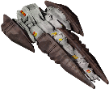

# **my endless-sky-plugins**
I aim at developing small and modular plugins that don't break vanilla lore too much.   
Please excuse bad english, spelling, grammar, etc... english isn't my mother tongue. Feel free to correct me.   

## Plugin List: 
<table><tr valign="top"><td><a href="README.md#additionalcommandbuttons">additional.command.buttons</a> 
<a href="README.md#automatadestruction0percent">automata.destruction.0percent</a> 
<a href="README.md#automatadestruction23percent">automata.destruction.23percent</a> 
<a href="README.md#automatadestruction51percent">automata.destruction.51percent</a> 
<a href="README.md#automatadestruction75percent">automata.destruction.75percent</a> 
<a href="README.md#automatainhumanspace">automata.in.human.space</a> 
<a href="README.md#betterstarts">better.starts</a> 
<a href="README.md#bunrodeamissions">bunrodea.missions</a> 
<a href="README.md#devil-rununhidden">devil-run.unhidden</a> 
</td><td><a href="README.md#disablepersonships">disable.person.ships</a> 
<a href="README.md#disablespaceportrepeatables">disable.spaceport.repeatables</a> 
<a href="README.md#freeworlds5yearslater">free.worlds.5.years.later</a> 
<a href="README.md#galacticcapitalinvestment">galactic.capital.investment</a> 
<a href="README.md#korefretshipyard">kor.efret.shipyard</a> 
<a href="README.md#morearfectas">more.arfectas</a> 
<a href="README.md#moreboardingmissions">more.boarding.missions</a> 
<a href="README.md#snowfeatherrobotics">snowfeather.robotics</a> 
<a href="README.md#toomanyasteroids">too.many.asteroids</a> 
<a href="README.md#uniquefix">unique.fix</a> 
</td></tr></table>

---

### additional.command.buttons

[additional.command.buttons.zip](https://github.com/zuckung/endless-sky-plugins/releases/download/Latest/additional.command.buttons.zip) | 160.13 kb | 2023-08-24 | [view files](https://github.com/zuckung/endless-sky-plugins/tree/main/myplugins/additional.command.buttons/)  
 
>Made for the mobile version and adds several new buttons to the lower right corner. See the readme for details.
>(inspired by theweirednut)

:blue_book: Plugin readme

<blockquote>### additional command buttons  

 

Made for the mobile version and changes the interface by adding the following 10 buttons:   

<ul>

<li>full stop</li>

<li>board ship</li>

<li>land on planet</li>

<li>fleet: harvest flotsam</li>

<li>fleet: hold position</li>

<li>fleet: gather around me</li>

<li>fleet: attack my target</li>

<li>fleet: toggle ammo usage</li>

<li>view player info</li>

<li>fast forward</li>

</ul>

and

<ul>

<li>adjusts the message box to not overlap</li>

<li>moved the hidden ammo box to a visible place</li>

</ul>

 

(inspired by theweirednut)  

 

 

Allthough most of these commands are now implemented in other parts to the original mobile user interface or can be accessed by gestures, I personally prefer these buttons on the lower right corner. 

 

Additional there are some functions in this plugin that the original mobile ui can't do at the moment: 

- board button cycles through the possibilities  

- fleet commands can be used for single ships when selected  

 

This plugin overwrites `interface "main buttons"` and `interface "hud"`, so it isn't compatible with other plugins modifying these. 

 

 

Chancelog: 

 

2023-08-24 

fixed non-fireing attack button 

 

2023-08-05 

moved the hidden ammo box to a visible place 

 

2023-08-02 

added new icon and reworked readme 

 

2023-07-26 

added 3 more buttons to a total of 10 

added descriptions inside script to exchange buttons functions 

 

2023-07-06 

changed 'fire afterburner' to new 'fleet: harvest flotsam', because afterburner can easily toggled by double tapping 
</blockquote>

 

---

### automata.destruction.0percent

[automata.destruction.0percent.zip](https://github.com/zuckung/endless-sky-plugins/releases/download/Latest/automata.destruction.0percent.zip) | 52.52 kb | 2023-06-17 | [view files](https://github.com/zuckung/endless-sky-plugins/tree/main/myplugins/automata.destruction.0percent/)  
 
>(14 ship attributes changed)(made for 0.10.1)
>github.com/zuckung/endless-sky-plugins
>
>Modifies the self destruction chance of Sestor and Mereti ships.
>Sestor 349/109/78/71/53/40/27 and Mereti 512/256/128/64/32/16/8 ships have a self destruction value of 0.0 (0%).

:blue_book: Plugin readme

<blockquote>### automata destruction 0percent  

(14 ship attributes changed)(made for 0.10.1)  

 

Modifies the self destruction chance of Sestor and Mereti ships.  

Sestor 349/109/78/71/53/40/27 and Mereti 512/256/128/64/32/16/8 ships have a self destruction value of 0.0 (0%).  
</blockquote>

 

---

### automata.destruction.23percent

[automata.destruction.23percent.zip](https://github.com/zuckung/endless-sky-plugins/releases/download/Latest/automata.destruction.23percent.zip) | 52.54 kb | 2023-06-17 | [view files](https://github.com/zuckung/endless-sky-plugins/tree/main/myplugins/automata.destruction.23percent/)  
 
>(14 ship attributes changed)(made for 0.10.1)
>github.com/zuckung/endless-sky-plugins
>
>Modifies the self destruction chance of Sestor and Mereti ships.
>Sestor 349/109/78/71/53/40/27 and Mereti 512/256/128/64/32/16/8 ships have a self destruction value of 0.12 (23%).

:blue_book: Plugin readme

<blockquote>### automata destruction 23percent  

(14 ship attributes changed)(made for 0.10.1)  

 

Modifies the self destruction chance of Sestor and Mereti ships.  

Sestor 349/109/78/71/53/40/27 and Mereti 512/256/128/64/32/16/8 ships have a self destruction value of 0.12 (23%).  
</blockquote>

 

---

### automata.destruction.51percent

[automata.destruction.51percent.zip](https://github.com/zuckung/endless-sky-plugins/releases/download/Latest/automata.destruction.51percent.zip) | 52.54 kb | 2023-06-17 | [view files](https://github.com/zuckung/endless-sky-plugins/tree/main/myplugins/automata.destruction.51percent/)  
 
>(14 ship attributes changed)(made for 0.10.1)
>github.com/zuckung/endless-sky-plugins
>
>Modifies the self destruction chance of Sestor and Mereti ships.
>Sestor 349/109/78/71/53/40/27 and Mereti 512/256/128/64/32/16/8 ships have a self destruction value of 0.3 (51%).

:blue_book: Plugin readme

<blockquote>### automata destruction 51percent  

(14 ship attributes changed)(made for 0.10.1)  

 

Modifies the self destruction chance of Sestor and Mereti ships.  

Sestor 349/109/78/71/53/40/27 and Mereti 512/256/128/64/32/16/8 ships have a self destruction value of 0.3 (51%).  
</blockquote>

 

---

### automata.destruction.75percent

[automata.destruction.75percent.zip](https://github.com/zuckung/endless-sky-plugins/releases/download/Latest/automata.destruction.75percent.zip) | 52.54 kb | 2023-06-17 | [view files](https://github.com/zuckung/endless-sky-plugins/tree/main/myplugins/automata.destruction.75percent/)  
 
>(14 ship attributes changed)(made for 0.10.1)
>github.com/zuckung/endless-sky-plugins
>
>Modifies the self destruction chance of Sestor and Mereti ships.
>Sestor 349/109/78/71/53/40/27 and Mereti 512/256/128/64/32/16/8 ships have a self destruction value of 0.5 (75%).

:blue_book: Plugin readme

<blockquote>### automata destruction 75percent  

(14 ship attributes changed)(made for 0.10.1)  

 

Modifies the self destruction chance of Sestor and Mereti ships.  

Sestor 349/109/78/71/53/40/27 and Mereti 512/256/128/64/32/16/8 ships have a self destruction value of 0.5 (75%).  
</blockquote>

 

---

### automata.in.human.space

[automata.in.human.space.zip](https://github.com/zuckung/endless-sky-plugins/releases/download/Latest/automata.in.human.space.zip) | 53.66 kb | 2023-06-17 | [view files](https://github.com/zuckung/endless-sky-plugins/tree/main/myplugins/automata.in.human.space/)  
 
>(14 ship variants, 16 variants in 4 fleets)(made for 0.10.1)
>github.com/zuckung/endless-sky-plugins
>
>Brings jump drive equipped automata into human space after the wanderer campaign. 
>You can find them where Korath ships in human space are usually found(ember waste and eastern syndicate). 
>The chance to encounter previous Korath ships or automata is like 50/50.

:blue_book: Plugin readme

<blockquote>### automata in human space  

(14 ship variants, 16 variants in 4 fleets)(made for 0.10.1)  

 

Brings jump drive equipped automata into human space after the wanderer campaign.  

You can find them where Korath ships in human space are usually found(ember waste and eastern syndicate).  

The chance to encounter previous Korath ships or automata is like 50/50.  
</blockquote>

 

---

### better.starts

[better.starts.zip](https://github.com/zuckung/endless-sky-plugins/releases/download/Latest/better.starts.zip) | 17.57 kb | 2023-08-05 | [view files](https://github.com/zuckung/endless-sky-plugins/tree/main/myplugins/better.starts/)  
 
>Adds 4 new start options with different ships, background storys, credits and debts. See the readme for details.

:blue_book: Plugin readme

<blockquote>### better.starts  

 

Adds 4 new start options with different ships, background storys, credits and debts. 

 

<ul>

<li>Start Cheater Leviathan: 100m credits, full visible human space, jump drive, in Sol system, no story</li>

<li>Start Salvager Argosy: equipped for boarding, in Aldhibain system</li>

<li>Start Salvager Shuttle: equipped for boarding, in Aldhibain system</li>

<li>Start Miner Clipper: equipped for mining, in Ascella system</li>

</ul>

 

Beside the cheat start option, all others are balanced . A bigger ship means a bigger bank loan. All starts come with 200.000 credits cash and a bank loan between 600.000 and 3.700.000 credits.

</blockquote>

 

---

### bunrodea.missions

[bunrodea.missions.zip](https://github.com/zuckung/endless-sky-plugins/releases/download/Latest/bunrodea.missions.zip) | 47.0 kb | 2023-09-01 | [view files](https://github.com/zuckung/endless-sky-plugins/tree/main/myplugins/bunrodea.missions/)  
 
>This plugin adds some missions to destroy Korath ships, which enable job board missions for raising the Bunrodea reputation. The first mission is available after the vanilla first contact mission. Doing more jobs will allow you to get access to all their planets and ships. See the readme for details.

:blue_book: Plugin readme

<blockquote>### bunrodea.missions

 

 

This plugin adds some missions to destroy Korath ships, which enable job board missions for raising the Bunrodea reputation. The first mission is available after the vanilla first contact mission. Doing more jobs will allow you to get access to all their planets and ships. 

 

Unlocking the planet with all ships needs 100 reputation. Unlocking the last of the planets needs 500 reputation. 

 

The vanilla first contact mission gives 10 rep. 

The first mission gives 20 rep and unlocks the first repeatable job which gives 10 rep. 

At 100 rep the second mission starts, which gives 30 rep and unlocks the second repeatable job with 30 rep each. 

 

As a little bonus, the second mission/job spawns a jumpdrive equipped "Lor'kas Ik 577" or "Ra'gru Ik 618" or "Ra'at Ik 621". 

 

 

202e-09-01 

added a 2nd mission and a 2nd repeatable job 

 

2023-08-26 

intial release 

</blockquote>

 

---

### devil-run.unhidden

[devil-run.unhidden.zip](https://github.com/zuckung/endless-sky-plugins/releases/download/Latest/devil-run.unhidden.zip) | 39.53 kb | 2023-08-31 | [view files](https://github.com/zuckung/endless-sky-plugins/tree/main/myplugins/devil-run.unhidden/)  
 
>Removes the hidden tag from system Devil-Run. It can be found near the core and opens the path to the Deep Space systems and the Devil-Hide system via wormhole. See the readme for details.

:blue_book: Plugin readme

<blockquote>### devil-run.unhidden

 

 

Removes the hidden tag from system Devil-Run. It can be found near the core and opens the path to the Deep Space systems and the Devil-Hide system via wormhole. 

 

Originally this system opens during hai reveal storyline, which is disabled because of a rework. Unfortunately some Remnant jobs rely on the Deep Space systems hidden behind a wormhole in Devil-Run. This plugin makes this system visible and reachable(by jump drive) in eastern syndicate. 

The Devil-Hide system is also a nice system to farm Marauder Leviathans. 

 

 

2023-08-31 

added icon.png 
</blockquote>

 

---

### disable.person.ships

[disable.person.ships.zip](https://github.com/zuckung/endless-sky-plugins/releases/download/Latest/disable.person.ships.zip) | 19.75 kb | 2023-08-31 | [view files](https://github.com/zuckung/endless-sky-plugins/tree/main/myplugins/disable.person.ships/)  
 
>Disables all person ships. See the readme for details.

:blue_book: Plugin readme

<blockquote>### disable.person.ships  

 

 

Disables all 14 random spawning person ships. 

 

<ul>

<li>	"Michael Zahniser" </li>

<li>	"Cap'n Pester" </li>

<li>	"Marauding Max" </li>

<li>	"Captain Nate" </li>

<li>	"Tranquility" </li>

<li>	"Power of the People" </li>

<li>	"Local God" </li>

<li>	"Subsidurial" </li>

<li>	"Prototype B3-CC4" </li>

<li>	"Rais Iris XVIII" </li>

<li>	"Zitchas" </li>

<li>	"Brick" </li>

<li>	"Gefullte Taubenbrust" </li>

<li>	"MasterOfGrey" </li>

</ul>

 

 

2013-08-31 

added icon.png 
</blockquote>

 

---

### disable.spaceport.repeatables

[disable.spaceport.repeatables.zip](https://github.com/zuckung/endless-sky-plugins/releases/download/Latest/disable.spaceport.repeatables.zip) | 19.95 kb | 2023-08-31 | [view files](https://github.com/zuckung/endless-sky-plugins/tree/main/myplugins/disable.spaceport.repeatables/)  
 
>Disables all repeatable spaceport missions. I.e. shady passenger transport, drug smuggling, time critical transport or defend planet. See the readme for details.

:blue_book: Plugin readme

<blockquote>### disable.spaceport.repeatables

 

 

Disables all spaceport repeatable missions. These missions annoy me. Basically removes the 8 dialog repeatables and the 6 defend planet missions. 

 

 

<ul>

<li> "Shady passenger transport 1" </li>

<li> "Shady passenger transport 2" </li>

<li> "Shady passenger transport 3" </li>

<li> "Drug Running 1" </li>

<li> "Drug Running 2" </li>

<li> "Drug Running 3" </li>

<li> "Courier 1" </li>

<li> "Courier 2" </li>

<li> "Southern Pirate Attack" </li>

<li> "Northern Pirate Attack" </li>

<li> "Core Pirate Attack" </li>

<li> "Pirate Occupation [0]" </li>

<li> "Pirate Occupation [1]" </li>

<li> "Pirate Occupation [2]" </li>

</ul>

 

 

2023-08-31 

added the 3 pirate occupation missions 

added icon.png 
</blockquote>

 

---

### free.worlds.5.years.later

[free.worlds.5.years.later.zip](https://github.com/zuckung/endless-sky-plugins/releases/download/Latest/free.worlds.5.years.later.zip) | 30.28 kb | 2023-08-05 | [view files](https://github.com/zuckung/endless-sky-plugins/tree/main/myplugins/free.worlds.5.years.later/)  
 
>Lets the free world war begin 5 years later. See the readme for details.

:blue_book: Plugin readme

<blockquote>### free.worlds.5.years.later  

 

Lets the free world war begin 5 years later. 

 

<ul>

<li>changes event "war begins" from 4 7 3014 to 4 7 3019</li>

<li>changes event "initial deployment 1" from 24 7 3014 to 24 7 3019</li>

<li>changes event "initial deployment 2" from 14 8 3014 to 14 8 3019</li>

<li>changes event "initial deployment 3" from 29 8 3014 to 29 8 3019</li>

<li>changes event "initial deployment 4" from 17 9 3014 to 17 9 3019</li>

</ul>

</blockquote>

 

---

### galactic.capital.investment

[galactic.capital.investment.zip](https://github.com/zuckung/endless-sky-plugins/releases/download/Latest/galactic.capital.investment.zip) | 26.63 kb | 2023-08-25 | [view files](https://github.com/zuckung/endless-sky-plugins/tree/main/myplugins/galactic.capital.investment/)  
 
>Implements a two mission chain that enables repeatable job board investment opportunities which result in small daily income. Available in human, quarg and hai space starting with 2 million credits cash and going up to 100 million credits. See the readme for details.
>(inspired by a-alhusaini's investment bank plugin)

:blue_book: Plugin readme

<blockquote>### galactic capital investment  

 

Implements a two mission chain that enables repeatable job board investment opportunities which result in small daily income. Available in human, quarg and hai space starting with 2 million credits cash and going up to 100 million credits.  

(inspired by a-alhusaini's investment bank plugin)  

 

There are missions for 1 million, 5 million, 10 million, 50 million and 100 million credits. The chance for the jobs to appear on the job board are 25% for each one. Unfortunately you have to take off and land again on the same planet to clear the mission marker. 

1 million = 600 credits daily  

5 million = 3.400 credits daily  

10 million = 7.200 credits daily  

50 million = 37.000 credits daily  

100 million = 76.100 credits daily  

 

These investments pay off after 3,5 to 4,5 years. Higher Investments pay off faster. 

 

 

2023-08-25 

added pirate planets as mission source

moved investment missions from spaceport mission to job board
</blockquote>

 

---

### kor.efret.shipyard

[kor.efret.shipyard.zip](https://github.com/zuckung/endless-sky-plugins/releases/download/Latest/kor.efret.shipyard.zip) | 52.51 kb | 2023-06-17 | [view files](https://github.com/zuckung/endless-sky-plugins/tree/main/myplugins/kor.efret.shipyard/)  
 
>(outfitter and shipyard added)(made for 0.10.1)
>github.com/zuckung/endless-sky-plugins
>
>Adds a shipyard with the the three Kor Efret ships(Arch-Carrack, Charm-Shallop, Echo-Galleon) to Laki Nemparu(Kashikt) in Kor Efret space. Also adds an outfitter with all outfits of these three ships.

:blue_book: Plugin readme

<blockquote>### kor efret shipyard  

(outfitter and shipyard added)(made for 0.10.1)  

 

Adds a shipyard with the the three Kor Efret ships(Arch-Carrack, Charm-Shallop, Echo-Galleon) to Laki Nemparu(Kashikt) in Kor Efret space. Also adds an outfitter with all outfits of these three ships.  
</blockquote>

 

---

### more.arfectas

[more.arfectas.zip](https://github.com/zuckung/endless-sky-plugins/releases/download/Latest/more.arfectas.zip) | 30.04 kb | 2023-08-05 | [view files](https://github.com/zuckung/endless-sky-plugins/tree/main/myplugins/more.arfectas/)  
 
>Adds the new system 'Pug Zak', near 'Pug Iyek' in Wanderer space. There you can farm rare spawning Arfectas and other more common Pug ships, without ruining your Pug reputation. See the readme for details.

:blue_book: Plugin readme

<blockquote>### more.arfectas  

 

Adds the new system 'Pug Zak', near 'Pug Iyek' in Wanderer space. There you can farm rare spawning Arfectas and other more common Pug ships, without ruining your Pug reputation. 

 

Added a new system, with new government "Pug Farm" and 3 new fleets. Two fleets are like the ones in 'Pug Iyek' and the third, rare spawning one, has 1 arfecta. It spawns within 15000 frames(~4 minutes). 

</blockquote>

 

---

### more.boarding.missions

[more.boarding.missions.zip](https://github.com/zuckung/endless-sky-plugins/releases/download/Latest/more.boarding.missions.zip) | 12.04 kb | 2023-08-28 | [view files](https://github.com/zuckung/endless-sky-plugins/tree/main/myplugins/more.boarding.missions/)  
 
>Adds lots of repeatable boarding and assisting missions for different factions. Boarding bigger ships give higher rewards or higher chances for credits or special items. See the readme for details.

:blue_book: Plugin readme

<blockquote>### more boarding missions  

 

 

Adds 27 boarding and assisting missions. Boarding Free Worlds, Republic, Syndicate, Militia, Pirates, Korath or Hai can trigger them. Bigger ships give higher rewards. 

 

<ul>

<li> 7 Pirate boarding missions for credits 

  (by ship categories, 20% chance, 5.000 to 25.000 credits, repeatable)</li>

<li> 4 Pirate boarding missions for an android 

  (by ship categories, 1-4% chance, outfit "NDR-114 Android" as reward, repeatable)</li>

<li> 7 Human assisting boarding missions 

  (by ship categories, 20% chance, 10.000 to 30.000 credits, repeatable)</li>

<li> 7 Hai assisting boarding missions 

  (by ship categories, 20% chance, 20.000 to 60.000 credits, repeatable)</li>

<li> 2 Korath boarding missions 

  (for the bigger ship categories, 2-3% chance, outfit "Cloaking Device" as reward, repeatable)</li>

</ul>

 

 

2023-08-29 

added 2 korath boarding missions with a rare chance for a cloaking device 

added 4 pirate boarding missions with rare chance for an android 

added icon and reworked readme 

</blockquote>

 

---

### snowfeather.robotics

[snowfeather.robotics.zip](https://github.com/zuckung/endless-sky-plugins/releases/download/Latest/snowfeather.robotics.zip) | 21.72 kb | 2023-08-28 | [view files](https://github.com/zuckung/endless-sky-plugins/tree/main/myplugins/snowfeather.robotics/)  
 
>Adds three missions that lead to adding androids to the outfitter on Snowfeather(Hai space).
>Starts on Snowfeather(Bore Fah) when having at least one android installed. See the readme for details.

:blue_book: Plugin readme

<blockquote>### snowfeather robotics  

 

 

Adds three missions that lead to adding androids to the outfitter on Snowfeather(Hai space).  

Starts on Snowfeather(Bore Fah) when having at least one android installed.  

 

To get an android, which is needed to start this plugin, do the remnant mission 'shattered light 4'. Alternatively my plugin 'more.boarding.missions' give androids as rare reward for boarding pirates. 

The new buyable androids are a little bit more expensive than the original ones. 

 

 

2023-08-29 

removed remnant mission requirement 
</blockquote>

 

---

### too.many.asteroids

[too.many.asteroids.zip](https://github.com/zuckung/endless-sky-plugins/releases/download/Latest/too.many.asteroids.zip) | 17.97 kb | 2023-09-01 | [view files](https://github.com/zuckung/endless-sky-plugins/tree/main/myplugins/too.many.asteroids/)  
 
>Removes all non-mineable asteroids from all systems. Mineable asteroids and asteroid belts are untouched.
>Increases game performance. See the readme for details.

:blue_book: Plugin readme

<blockquote>### too many asteroids  

 

 

Removes all non-mineable asteroids from all systems. Mineable asteroids and asteroid belts are untouched.  

Increases game performance. 

 

 

Every of the 552 base game systems(0.10.2) is edited via remove command for full compatibility with other system altering plugins. A total of 2654 asteroid entries got removed. 

In case i won't update this plugin to the newest game version, a python script for generating an updated plugin can be found <a href="https://github.com/zuckung/endless-sky-plugins/tree/main/tools/too_many_asteroids_plugin_script">here</a>. 

 

 

2023-09-01 

added new icon.png 

reworked readme 

removed py script 

 

2023-06-17 

updated to 0.10.1 

added a python script which generates the asteroids.txt(in case I don't update this mod, everyone can do it in no time.) 
</blockquote>

 

---

### unique.fix

[unique.fix.zip](https://github.com/zuckung/endless-sky-plugins/releases/download/Latest/unique.fix.zip) | 202.8 kb | 2023-08-31 | [view files](https://github.com/zuckung/endless-sky-plugins/tree/main/myplugins/unique.fix/)  
 
>Removes mass and outfit space from some uniques, puts others into unique category, or gives a png if there isn't one. See the readme for details.

:blue_book: Plugin readme

<blockquote>### unique fix

 

 

Removes mass and outfit space from some uniques, puts others into unique category, or gives a png if there isn't one. See the readme for details. 

 

 

<ul>

<li> Removes mass and outfit space from the cloaking device. </li>

<li> Removes mass and outfit space from outskirts gauger and puts it in unique category. </li>

<li> Gives outfit '"Puny"' a portrait. </li>

<li> Puts outfit 'Mug' into unique category and gives it a portrait </li>

</ul>

 

 

2023-8-31 

added 'Mug' to unique category and added a portrait 

changed puny portrait 

changed icon.png 
</blockquote>

 
