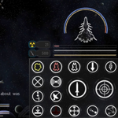
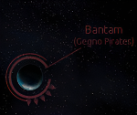
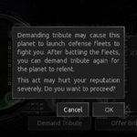

# **my endless-sky-plugins**
I aim at developing small, modular and maximal compatible plugins that don't break vanilla lore too much.  
Please excuse bad English, spelling, grammar, etc... English isn't my mother tongue. Feel free to correct me. 
<a href="https://github.com/zuckung/endless-sky-plugins/pulls">Pull requests</a>, <a href="https://github.com/zuckung/endless-sky-plugins/discussions">discussions</a> and <a href="https://github.com/zuckung/endless-sky-plugins/issues">Issue reports</a> are welcome!  
 
Furthermore, I'd like to present <a href="https://zuckung.github.io/ES-DataParser/">https://zuckung.github.io/ES-DataParser/</a> to other plugin creators or people who seek information inside the data folder. Basically it is a very fast website to view every object of the data folder, especially when you don't know where to find something. For an easier browsing and comparing of game objects, like missions, ships, systems, and others. 
     
 
 
If you are familiar with Python, the scripts in the <a href="tools/README.md">tools-folder</a> might be interesting. There are a few to generate some of my plugins (to keep them up-to-date). And others like an ES jpg map creator or a PR files downloader. 
 
I've got another new project, a github repository that lets you online generate a galaxy with up to 500 star systems and some more options to configurate that galaxy. When done, you can download it as a plugin. Here is the link. <a href="https://github.com/zuckung/ES-GalaxyGenerator">https://github.com/zuckung/ES-GalaxyGenerator</a> 
 

 

## Latest News:
<table><tr><td> 2025-03-14 | update: additional.command.buttons.radial 
2025-03-14 | update: highrollers.ltd 
2025-03-11 | update: highrollers.ltd 
2025-03-11 | update: gegno.pirates 
2025-02-28 | update: additional.command.buttons.radial 
2025-02-26 | update: mission.helper 
2025-02-23 | update: additional.command.buttons.radial 
2025-02-20 | update: mission.helper 
2025-02-17 | update: mission.helper 
2025-02-14 | update: galactic.capital.investment 
 </td></tr></table>

## Plugin List: 
<table><tr valign="top"><td> 
<a href="README.md#additionalcommandbuttonsradial">additional.command.buttons.radial</a> 
<a href="README.md#automatadestruction0percent">automata.destruction.0percent</a> 
<a href="README.md#automatainhumanspace">automata.in.human.space</a> 
<a href="README.md#avgilicenses">avgi.licenses</a> 
<a href="README.md#betterstarts">better.starts</a> 
<a href="README.md#bunrodeamissions">bunrodea.missions</a> 
<a href="README.md#captureablepersonships">captureable.person.ships</a> 
<a href="README.md#coalitionshopping">coalition.shopping</a> 
<a href="README.md#controlstation">control.station</a> 
<a href="README.md#disablepersonships">disable.person.ships</a> 
<a href="README.md#disablespaceportrepeatables">disable.spaceport.repeatables</a> 
<a href="README.md#expertcrewmembers">expert.crew.members</a> 
<a href="README.md#freeworlds5yearslater">free.worlds.5.years.later</a> 
<a href="README.md#galacticcapitalinvestment">galactic.capital.investment</a> 
 </td><td> 
<a href="README.md#gegnopirates">gegno.pirates</a> 
<a href="README.md#haisidemissionunlocker">hai.side.mission.unlocker</a> 
<a href="README.md#highrollersltd">highrollers.ltd</a> 
<a href="README.md#humanlabels">human.labels</a> 
<a href="README.md#jumpgates">jump.gates</a> 
<a href="README.md#kestrelunlocks">kestrel.unlocks</a> 
<a href="README.md#korefretshipyard">kor.efret.shipyard</a> 
<a href="README.md#landingimages">landing.images</a> 
<a href="README.md#landingimagesandroid">landing.images.android</a> 
<a href="README.md#landingimageshighres">landing.images.highres</a> 
<a href="README.md#missionhelper">mission.helper</a> 
<a href="README.md#morearfectas">more.arfectas</a> 
<a href="README.md#moreboardingmissions">more.boarding.missions</a> 
<a href="README.md#morepersonships">more.person.ships</a> 
 </td><td> 
<a href="README.md#navylicenses">navy.licenses</a> 
<a href="README.md#nomoremeretimines">no.more.mereti.mines</a> 
<a href="README.md#outfitsweaponslot">outfits.weapon.slot</a> 
<a href="README.md#paintyourships">paint.your.ships</a> 
<a href="README.md#planetmap">planet.map</a> 
<a href="README.md#planetpluto">planet.pluto</a> 
<a href="README.md#quargfarm">quarg.farm</a> 
<a href="README.md#showreputation">show.reputation</a> 
<a href="README.md#snowfeatherrobotics">snowfeather.robotics</a> 
<a href="README.md#spacefauna">space.fauna</a> 
<a href="README.md#toomanyasteroids">too.many.asteroids</a> 
<a href="README.md#tributerepublic">tribute.republic</a> 
<a href="README.md#uniques">uniques</a> 
 </td></tr></table>

---

### additional.command.buttons.radial

[additional.command.buttons.radial.zip](https://github.com/zuckung/endless-sky-plugins/releases/download/v1.0.19-additional.command.buttons.radial/additional.command.buttons.radial.zip) | 201.07 kb | 2025-03-14 | [view files](https://github.com/zuckung/endless-sky-plugins/tree/main/myplugins/additional.command.buttons.radial/) | <a href="res/imagemd/additional.command.buttons.radial.md">view images</a> [47] 
 
>Reworks the main buttons ui on the lower right side. Made for the ANDROID version of ES. See the README for details.

:blue_book: Plugin readme

<blockquote>### additional.command.buttons  

 

Reworks the main buttons ui on the lower right side. Made for the ANDROID version of ES.  

 

 

This plugin 

- rearranges and resizes some of the buttons 

- changes most icons (making a ring around as a standard)

- adds more permanent buttons from the radial menus to make them easy accessible 

- removes the radial menus 

- adds a new button row to the top right for the fleet commands 

- adds zoom buttons 

- adds more targeting buttons 

- greyes out inactive buttons 

- puts images behind the buttons, to grey out unavailable. 

- changes the ship hud 

 

 

 

Changelog: 

 

2025-03-14 

added reverse thrust/afterburner button to bottom left 

 

2025-02-28 

moved the fleet box below the text box 

adjusted onscreen joystick size 

 

2025-02-23 

added new fleet jump button 

moved targeting buttons to the lower right 

removed fleet attack from normal attack button 

removed targeting button from target display 

 

2025-02-06 

the targeting buttons blocked the new scanner attribute display, so i moved it up 

hollowed and colorized the targeting buttons 

 

2025-02-04 

increased the size of the fuel, energy and heat bar to handle fuel up to 4400 

resized message box to not overlap with 2 rows of escorts 

restored the somehow missing tactical information display 

added "target nearest enemy" and "target nearest asteroid" buttons 

removed the color folders, white is enough 

 

2024-12-28 

moved the ammo box to the left side if the lower buttons 

added ship hud (inspired by Upmost Bsc | https://github.com/tobersj/Central-HUD) 

 

2024-11-20 

added small main menu button to the top left corner (requested by tarminu) 

 

2024-11-02 

removed hold fire button, because it's unsure when/if it comes back 

changed fast forward button back to small again, because it messed up the mission overview 

added 5 colour schemes(red, green, blue, purple, orange)

 

2024-10-29 

deactivated hold fire button, because it got removed in 0.10.10 

 

2024-10-11 

added fleet formations button 

 

2024-10-07 

added fleet hold fire button 

 

2024-09-06 

fine tuning for the graphics 

 

2024-09-02 

fixed button radius typo on fleet gather 

moved the fleet commands to the right side, so the jump systems are better seen 

 

2024-08-31 

changed button background to look more natural 

 

2024-08-30 

fixed an error 

adjusted positions 

added zoom buttons 

all buttons are visible now, but greyed out if you can't use them 

reworked all buttons to display a ring around them 

resized the fast forward button in the upper left corner, and added a greyed out version 

 

2024-08-25 

added a new panel for the fleet commands to the top center 

reworked the toggle ammo button 

removed the expandable radial menus, because all buttons are on the screen now 

exchanged some of the button positions 

 

2024-05-09 

initial release 
</blockquote>

 
screenshots(click to enlarge): 
<table>
	<tr>
		<td></td>
	</tr>
</table>
 

 

---

### automata.destruction.0percent

[automata.destruction.0percent.zip](https://github.com/zuckung/endless-sky-plugins/releases/download/v1.0.1-automata.destruction.0percent/automata.destruction.0percent.zip) | 44.08 kb | 2024-06-07 | [view files](https://github.com/zuckung/endless-sky-plugins/tree/main/myplugins/automata.destruction.0percent/) | <a href="res/imagemd/automata.destruction.0percent.md">view images</a> [1] 
 
>Modifies the self destruction chance of Sestor and Mereti ships to a value of 0.0 (0%). See the README for details.

:blue_book: Plugin readme

<blockquote>### automata.destruction.0percent

 

 

Modifies the self destruction chance of Sestor and Mereti ships to a value of 0.0 (0%). 

 

Sestor 349/109/78/71/53/27/14 and Mereti 512/256/128/64/32/16/8 ships have a self destruction value of 0.0 (0%) now. 

You can easily change the values in automata.txt for each ship ('"self destruct" .0') to a value of your choice. I.e. 0.12 is 23%, 0.3 is 51%, 0.5 is 75%. Its calculated twice, first the chance for self destruction on boarding(i.e. 0.3) is 30%, then of the remaining 70% again 30% chance for self destruction on capturing. That makes 30% + 21% = 51% overall chance for self destruction on a capturing try. 

 

 

Changelog: 

 

2024-06-07 

text corrections (thx to TheGiraffe3) 

 

2023-10-17 

added plugin.txt 

 

2023-09-07 

changed icon 

changed about.txt 

changed readme 

</blockquote>

 

---

### automata.in.human.space

[automata.in.human.space.zip](https://github.com/zuckung/endless-sky-plugins/releases/download/v1.0.1-automata.in.human.space/automata.in.human.space.zip) | 35.86 kb | 2024-09-24 | [view files](https://github.com/zuckung/endless-sky-plugins/tree/main/myplugins/automata.in.human.space/) | <a href="res/imagemd/automata.in.human.space.md">view images</a> [1] 
 
>Brings jump drive equipped automata into human space after the wanderer campaign. See the README for details.

:blue_book: Plugin readme

<blockquote>### automata.in.human.space

 

 

Brings jump drive equipped automata into human space after the wanderer campaign.  

 

You can find them where Korath ships in human space are usually found(ember waste and eastern syndicate).  

The chance to encounter previous Korath ships or automata is like 50/50.  

 

 

Changelog: 

 

2024-09-24 

removed jumpdrive from fighters and drones and put them correctly into the carriers 

adjusted some fleet variants 

 

2023-10-17 

added plugin.txt 

 

2023-09-01 

added more fleet variants  

reworked readme  

changed icon.png 

</blockquote>

 

---

### avgi.licenses

[avgi.licenses.zip](https://github.com/zuckung/endless-sky-plugins/releases/download/v1.0.0-avgi.licenses/avgi.licenses.zip) | 375.21 kb | 2025-02-06 | [view files](https://github.com/zuckung/endless-sky-plugins/tree/main/myplugins/avgi.licenses/) | <a href="res/imagemd/avgi.licenses.md">view images</a> [9] 
 
>Adds a mission on "Navigeo Yards" to get the 3 Avgi licenses. See the README for details.

:blue_book: Plugin readme

<blockquote>### avgi.licenses 

 

Adds a mission on "Navigeo Yards" to get the 3 Avgi licenses. 

 

 

When you have completed the Avgi Intro (Avgi: Twilight Escape 3: done), land on "Navigeo Yards". You have a 20% chance kn getting the licenses mission, which leads you to the Gossamer system, where you have to mine some stuff and bring it back. Licenses have new images. You also get an unassigned Avgi unique. 

 

 

Changelog: 

 

2025-02-06 

initial release 

</blockquote>

 

---

### better.starts

[better.starts.zip](https://github.com/zuckung/endless-sky-plugins/releases/download/v1.0.4-better.starts/better.starts.zip) | 23.58 kb | 2024-12-19 | [view files](https://github.com/zuckung/endless-sky-plugins/tree/main/myplugins/better.starts/) | <a href="res/imagemd/better.starts.md">view images</a> [1] 
 
>Adds several new start options with different ships, background stories, credits and debts. See the README for details.

:blue_book: Plugin readme

<blockquote>### better.starts  

 

Adds several new start options with different ships, background stories, credits and debts. 

 

<ul>

<li>Start: Trader | Freighter: equipped for cargo transport, in Merak system</li>

<li>Start: Trader (Hai) | Aphid: equipped for cargo transport, in Fah Soom system(Hai space)</li>

<li>Start: Passenger Transport | Scout: equipped for passenger transport, Talita system</li>

<li>Start: Miner | Sunder: equipped for mining, in Rasalhague system</li>

<li>Start: Salvager | Shuttle: equipped for boarding, in Aldhibain system</li>

<li>Start: Salvager(big) | Argosy: equipped for boarding, in Aldhibain system</li>

<li>Start: Explorer to Remnant | Heavy Shuttle: equipped for exploring the Remnant, in Tania Australis system</li>

<li>Start: Explorer to Automata | Bounder: equipped for exploring the Kor Automata, in Mirfak system</li>

<li>Start: Cheater 1 | Heron + 10xKIV: 1b credits, full visible human space, Jump Drive, in Sol system, no story</li>

<li>Start: Cheater 2 | Heron + 10xSkylark: 1b credits, full visible human space, Jump Drive, in Sol system, no story</li>

</ul>

 

Beside the cheater start options, all others are balanced and lore friendly. A bigger ship means a bigger bank loan. All starts come with 200.000 credits cash and a bank loan between 600.000 and 4,5 million credits. The ships outfits are changed to fit the role. The intro missions on New Boston are set as completed. Same goes for the Hai start with the Hai first contact mission. 

 

 

Changelog: 

 

2024-11-02  

changed cheater 2 start heron to have 20 heavy warship bays 

 

2024-10-08  

proofreading and minor text changes (Vemenous-Repentile) 

added a new cheater start with Quarg outfits, ships and more credits 

 

2024-06-07 

text corrections (thx to TheGiraffe3) 

 

2024-03-15 

Start: Cheater, changed Heron weapons and added 10x KIV with beam weapons 

Start: Cheater, added mission for full visible human space to the outfitter 

 

2024-02-15 

Start: Cheater... fixed map not showing all systems 

Start: Miner... changed ship to "Sunder" with 2 Mining Drones 

 

2023-10-17 

added plugin.txt 

 

2023-09-15 

added passenger transport start 

set intro missions to done for all starts 

doubled bank loan duration / halfed interest rate for all starts 

changed cheater start ship and credits 

 

2023-09-03 

changed miner start to a system with outfitter 

added Start Trader Freighter 

added Start Trader (Hai) Aphid 

added Start Explorer to Remnant 

added Start Explorer to Automata 

</blockquote>

 
screenshots(click to enlarge): 
<table>
	<tr>
		<td></td>
	</tr>
</table>
 

 

---

### bunrodea.missions

[bunrodea.missions.zip](https://github.com/zuckung/endless-sky-plugins/releases/download/v1.0.7-bunrodea.missions/bunrodea.missions.zip) | 2.92 mb | 2025-02-13 | [view files](https://github.com/zuckung/endless-sky-plugins/tree/main/myplugins/bunrodea.missions/) | <a href="res/imagemd/bunrodea.missions.md">view images</a> [45] 
 
>Adds some missions and jobs to increase the Bunrodea reputation. The first mission is available after the vanilla first contact mission. Doing more jobs will allow you to get access to all their planets and ships. See the README for details.

:blue_book: Plugin readme

<blockquote>### bunrodea.missions

 

 

This plugin adds some missions to destroy Korath ships, which enable job board missions for raising the Bunrodea reputation. The first mission is available after the vanilla first contact mission. Doing more jobs will allow you to get access to all their planets and ships. 

 

Unlocking the planets is based on reputation, so you get access step by step. Unlocking the last of the planets(with the big shipyard) needs 500 reputation. 

 

Some missions from landing/spaceport unlock jobs. Others just give reputation or unlock story progression. Each job gives 5 to 40 reputation. 

Averagely you have to do like 50 jobs, less if you take the fighting jobs. Like in vanilla play, hit spaceport often. 

 

Since it's often questioned, here is a guide to the bunrodea first contact mission. Travel through Bunrodea territory till you've killed at least one Bunrodea ship, then fly to a human system, land there and you get a mission that mission brings you back to the Bunrodea. You can land on 4 planets now, and at this point this plugin starts. 

 

 

Changelog: 

 

2025-02-13 

somehow i forgot the @2x images, now they are in 

 

2025-02-10 

added @2x images 

changed news portraits, because of a conflict with expert.crew.members 

 

2024-10-08  

proofreading and minor text changes (Vemenous-Repentile) 

 

2024-06-07 

text correction (thx to Dagroth) 

 

2024-06-07 

text corrections (thx to TheGiraffe3) 

 

2024-04-30 

fixed error on natural spawning korath fleets 

changed some space port news and jobs to require culture conversations 

changed culture conversation chance from 10% to 20% 

changed icon 

changed reputation needed for planet landings, to make the progression more fluent 

changed first contact mission chance to 100%, from 10% (for pilcrow) 

changed filenames (delete old files on update) 

added 5 new jobs 

added 6 side missions/chains, most with scene images 

added 1 person ship (thx pilcrow) 

added language bunrodea and friendly hails 

added minable asteroids to the systems 

 

2024-04-10 

added 4 scene images 

added 2 invisible missions to fix storyline on update / on loss of uniques 

changed gift at full rep from ship to a unique 

added 2 new culture conversations: flonkball / snap fly hunt 

added more spaceport news and regrouped them 

rebalanced the worldship mission/job, to nearly same chances as in vanilla fleets. (2,5%=582,590,577,Rai'alorej and 50%=618 and 40%=621) 

added "Kas'lor Ik 582 (Jump)" and "Lor'nag Ik 590 (Troop Transport)" and "Rai'alorej" to worldship mission/jobs 

 

2024-04-04 

added lots of spaceport news, with portraits 

added 3 new medium transport jobs 

changed execution culture conversation and jobs to 300 rep 

changed korath defense missions from landing to spaceport, and added choice to defer 

changed reputation needed on Bunthro and Erabuthro to reflect the progression 

changed chance for the 577 worldship to 10% 

 

2024-03-15 

bugfixes 

added first contact guide to readme 

added unique outfit "Bunrodea Translation Device" 

added 2 more hunt criminal jobs 

 

2024-03-11 

fixed missions not starting bug  

removed worldship fleets from the 3 border systems 

added normal korath fleets to the 3 border systems 

added 3rd fight mission(worldship) and repeatable job(25% chance) 

added 3 rush delivery jobs 

added criminal hunt culture conversation(25% chance) and repeatable job(35% chance) after 

added final mission at 500 reputation 

 

2024-02-18 

fixed unplayable first mission, if it gets started direct after the first contact 

 

2023-10-17 

added plugin.txt 

 

2023-09-02 

changed fleet missions/jobs to include only Palavret and Rano'erek 

added korath fleets to Era Natta, Genta Bo and Eneva Katta 

added 6 transport/passenger jobs 

 

2023-09-01 

added a 2nd mission and a 2nd repeatable job 

 

2023-08-26 

initial release 

</blockquote>

 
screenshots(click to enlarge): 
<table>
	<tr>
		<td></td>
		<td></td>
		<td></td>
	</tr>
	<tr>
		<td></td>
		<td></td>
		<td></td>
	</tr>
</table>
 

 

---

### captureable.person.ships

[captureable.person.ships.zip](https://github.com/zuckung/endless-sky-plugins/releases/download/v1.1.7-captureable.person.ships/captureable.person.ships.zip) | 140.92 kb | 2025-01-27 | [view files](https://github.com/zuckung/endless-sky-plugins/tree/main/myplugins/captureable.person.ships/) | <a href="res/imagemd/captureable.person.ships.md">view images</a> [3] 
 
>Makes person ships capturable. See the README for details.

:blue_book: Plugin readme

<blockquote>### capturable.person.ships

 

 

Makes person ships captureable.  

 

 

Well, technically this plugin disables the person ships, and creates new ones which are captureable (with changed names to "<name> (disable me)", due to limitations of changing parts of the originals). Also adds all of them to the author government, adjusts some personalities and sets all frequencies to 1000. Changed "Tranquility" to have a weapon, so it doesn't flee. And changed "Zitchas" personality to "decloaked", so it doesn't flee and regenerate while cloaked. 

Attacking one of them makes all your enemies, they all try to disable instead of destroying, and they all have the same spawn chance which is in average within 10 minutes. 

 

At Earth's job board you can find a repeatable job that displays which persons you have already killed, which are alive, and where to find them. 

After you've killed them all, you receive a small unique gift. 

 

I tested this plugin with 10x KIV349, all equipped with Mereti beam weapons, was probably an overkill on most. Boarding "Zitchas"(1000 crew) needed an Echo-Galleon, and I tried it with hand2hand outfits plugin. Maybe it works with nerve gas too. 

In cap_persons.txt you find the following line under gamerules: "#	"person spawn period" 2000". If you remove the "#" the spawning speed is increased to one spawn in max a minute. 

<ul>

<li>"vyu-Ir" (not a person ship, but unique | found south-western of Gegno)</li>

<li>"Michael Zahniser" (found everywhere | Kestrel + Finch)</li>

<li>"Cap'n Pester" (found everywhere | Quarg Wardragon)</li>

<li>"Marauding Max" (found everywhere | Marauder Fury)</li>

<li>"Captain Nate" (found everywhere | Vanguard)</li>

<li>"Tranquility" (found everywhere | Lampyrid)</li>

<li>"Power of the People" (found everywhere | Modified Osprey)</li>

<li>"Local God" (found everywhere | Ursa Polaris)</li>

<li>"Subsidurial" (found in uninhabited | Subsidurial)</li>

<li>"Prototype B3-CC4" (found in Ember Waste | Shooting Star)</li>

<li>"Rais Iris XVIII" (found everywhere | Marauder Bactrian)</li>

<li>"Zitchas" (found in Ember Waste | Heron + Peregrine + 4x Petrel + 32x Tern)</li>

<li>"Brick" (found everywhere | 3x Modified Boxwing)</li>

<li>"Gefullte Taubenbrust" (found everywhere | Modified Battleship)</li>

<li>"MasterOfGrey" (found in Hai space | Modified Ladybug)</li>

<li>"Patrol Team" (found everywhere | 6x Waverider)</li>

<li>"Danau" (found in human space | 1x mod. Hauler IV, 2x Hauler III, 2x Hauler II, 2x Hauler)</li>

</ul>

 

 

Changelog: 

 

2025-01-27 

added 0.10.11 person "Danau" 

 

2024-11-11 

made vyu-Ir captureable (unique, but no person ship) 

normalized the spawn speed 

 

2024-10-08 

proofreading and minor text changes (Vemenous-Repentile) 

changed status mission to fail on daily 

changed subsidural (1 outfit space, keystone and 300 fuel) 

 

2024-07-14 

fixed tranquility weapon space error 

removed fines from author government 

 

2024-06-07 

text corrections (thx to TheGiraffe3) 

 

2024-05-28 

adjusted mass and drag to be like in 0.10.7 

removed staying personality ftom Tranquility 

renamed persons to "name (C)", was "name (Capture me)" 

 

2024-04-06 

set person killed job back to earth only, less annoying when you are done 

added a mission with unique reward, after killing all person ships 

 

2024-03-23 

set "no person spawn weight" to 0 

added person destroyed check job to every planet with a job board 

added a gun to Tranquility so that it stays for fighting 

changed Zitchas personality, so that it doesn't cloak 

 

2024-03-14 

bugfixes 

added person destroyed check on Earth job board 

 

2024-02-02 

added 0.10.5 person "Patrol Team" 

 

2023-10-17 

added plugin.txt 

 

2023-09-15 

changed gamerules back, because it caused mass spawning 

changed some personalities 

 

2023-09-09 

changed all frequencies to 1000 

changed gamerules to prevent no spawning chance 

 

2023-09-08 

initial release 

</blockquote>

 
screenshots(click to enlarge): 
<table>
	<tr>
		<td></td>
	</tr>
</table>
 

 

---

### coalition.shopping

[coalition.shopping.zip](https://github.com/zuckung/endless-sky-plugins/releases/download/v1.0.6-coalition.shopping/coalition.shopping.zip) | 403.06 kb | 2024-11-09 | [view files](https://github.com/zuckung/endless-sky-plugins/tree/main/myplugins/coalition.shopping/) | <a href="res/imagemd/coalition.shopping.md">view images</a> [5] 
 
>Adds all Coalition/Heliarch/Lunarium outfits and ships to "Far Home" in the "Homeward" system. See the README for details.

:blue_book: Plugin readme

<blockquote>### coalition.shopping

 

 

Adds all Coalition/Heliarch/Lunarium outfits and ships to 'Far Home' in 'Homeward' system. 

 

Adds all existing coalition outfitters and shipyards to 'Far Home'. Also adds a new shipyard and a new outfitter with missing ships/outfits. 

To start the mission to enable these outfitters and shipyards, you have to join Heliarch or Lunarium (complete the first chapter of these storylines) and own/pay 6/5 million credits. The mission starts anywhere in coalition space. I added this plausible mission to make the plugin feel less cheaty. 

 

 

Changelog: 

 

2024-11-09 

corrected scene size 

added @2x images 

 

2024-09-15 

some error fixing, adjustments and text improvements (thx to timeout.fu) 

more text adjustments (from TheGiraffe3) 

 

2024-05-04 

added 2 scene images 

added a plausible story mission for heliarch and one for lunarium players 

 

2024-04-21 

fixed error on coalition basics outfitter 

 

2023-10-17 

added plugin.txt 

 

2023-10-05 

initial release 

</blockquote>

 
screenshots(click to enlarge): 
<table>
	<tr>
		<td></td>
		<td></td>
	</tr>
</table>
 

 

---

### control.station

[control.station.zip](https://github.com/zuckung/endless-sky-plugins/releases/download/v1.0.1-control.station/control.station.zip) | 231.84 kb | 2024-05-14 | [view files](https://github.com/zuckung/endless-sky-plugins/tree/main/myplugins/control.station/) | <a href="res/imagemd/control.station.md">view images</a> [3] 
 
>Adds a station to the Sol system that offers administrative functions started by the job board. See the README for details.

:blue_book: Plugin readme

<blockquote>### control.station

 

 

Adds a station to the Sol system that offers administrative functions started by the job board. See the readme for details. 

 

Current functions: 

show reputation 

show person ships 

show all vanilla system 

complete free worlds reconciliation campaign 

complete free worlds checkmate campaign 

complete free worlds both campaigns 

complete hai reveal 0 prolog 

complete remnant campaign 

 

Completing the campaigns might not exactly have the same result as if the campaign was played. There is a massive amount of events, that might suppress other events, when done on the same day. It looks good now, but not sure if that's really the case. 

So lets call this plugin EXPERIMENTAL for now. 

 

 

Changelog: 

 

2024-05-14 

fixed all events set not correct 

fixed fw mission offered on clink 

fixed vanilla fw events with dates overwriting the set done 

added 100 Neutral rep so you can land on the former Pug planets 

added -100 Pirate rep 

added checkmate option 

added both branches option 

added hai reveal 0 done job 

added remnant done job 

added reveal whole galaxy job 

 

2024-05-09 

initial release 

</blockquote>

 
screenshots(click to enlarge): 
<table>
	<tr>
		<td></td>
		<td></td>
	</tr>
</table>
 

 

---

### disable.person.ships

[disable.person.ships.zip](https://github.com/zuckung/endless-sky-plugins/releases/download/v1.0-disable.person.ships/disable.person.ships.zip) | 20.08 kb | 2024-04-06 | [view files](https://github.com/zuckung/endless-sky-plugins/tree/main/myplugins/disable.person.ships/) | <a href="res/imagemd/disable.person.ships.md">view images</a> [1] 
 
>Disables all person ships. See the README for details.

:blue_book: Plugin readme

<blockquote>### disable.person.ships  

 

 

Disables all 14 random spawning person ships. 

 

<ul>

<li>	"Michael Zahniser" </li>

<li>	"Cap'n Pester" </li>

<li>	"Marauding Max" </li>

<li>	"Captain Nate" </li>

<li>	"Tranquility" </li>

<li>	"Power of the People" </li>

<li>	"Local God" </li>

<li>	"Subsidurial" </li>

<li>	"Prototype B3-CC4" </li>

<li>	"Rais Iris XVIII" </li>

<li>	"Zitchas" </li>

<li>	"Brick" </li>

<li>	"Gefullte Taubenbrust" </li>

<li>	"MasterOfGrey" </li>

<li>	"Patrol Team" </li>

</ul>

 

 

Changelog: 

 

2024-02-02 

added 0.10.5 "Patrol Team" 

 

2023-10-17 

added plugin.txt 

 

2013-08-31 

added icon.png 
</blockquote>

 

---

### disable.spaceport.repeatables

[disable.spaceport.repeatables.zip](https://github.com/zuckung/endless-sky-plugins/releases/download/v1.1.1-disable.spaceport.repeatables/disable.spaceport.repeatables.zip) | 20.57 kb | 2024-05-26 | [view files](https://github.com/zuckung/endless-sky-plugins/tree/main/myplugins/disable.spaceport.repeatables/) | <a href="res/imagemd/disable.spaceport.repeatables.md">view images</a> [1] 
 
>Disables all repeatable spaceport missions. I.e. shady passenger transport, drug smuggling, time critical transport or defend planet. See the README for details.

:blue_book: Plugin readme

<blockquote>### disable.spaceport.repeatables

 

 

Disables all spaceport repeatable missions. These missions annoy me. Removes the 8 dialog repeatables, the 8 defend planet missions and the 4 republic catastrophe repeatables. 

 

 

<ul>

<li> "Shady passenger transport 1" </li>

<li> "Shady passenger transport 2" </li>

<li> "Shady passenger transport 3" </li>

<li> "Drug Running 1" </li>

<li> "Drug Running 2" </li>

<li> "Drug Running 3" </li>

<li> "Courier 1" </li>

<li> "Courier 2" </li>

<li> "Southern Pirate Attack" </li>

<li> "Northern Pirate Attack" </li>

<li> "Core Pirate Attack" </li>

<li> "Pirate Occupation [0]" </li>

<li> "Pirate Occupation [1]" </li>

<li> "Pirate Occupation [2]" </li>

<li> "Raider Attack 1" </li>

<li> "Raider Attack 2" </li>

<li> "Republic Navy Advisory System [frozen]" </li>

<li> "Republic Navy Advisory System [volcanic]" </li>

<li> "Republic Navy Advisory System [wildfire cargo]" </li>

<li> "Republic Navy Advisory System [wildfire firefighters]" </li>

<li> "Small Scale Delivery" (Kor Efret)<li>

</ul>

 

 

Changelog: 

 

2024-05-26 

added "Small Scale Delivery" from Kor Efret 

 

2024-04-06 

added the 4 republic catastrophe repeatables 

 

2023-10-17 

added plugin.txt 

 

2023-09-03 

added the 2 syndicate alien attack missions 

 

2023-08-31 

added the 3 pirate occupation missions 

added icon.png 
</blockquote>

 

---

### expert.crew.members

[expert.crew.members.zip](https://github.com/zuckung/endless-sky-plugins/releases/download/v1.0.6-expert.crew.members/expert.crew.members.zip) | 7.75 mb | 2025-02-06 | [view files](https://github.com/zuckung/endless-sky-plugins/tree/main/myplugins/expert.crew.members/) | <a href="res/imagemd/expert.crew.members.md">view images</a> [193] 
 
>Adds unique crew members, aquireable through low chance spaceport missions. These crew members are technically outfits which require a bunk and a salary, but no outfit space or mass. They add, depending on their technology field, stats to your ship. Like shield regeneration, more thrust, more cargo etc. See the README for details.

:blue_book: Plugin readme

<blockquote>### expert.crew.members

 

 

Adds unique crew members, aquireable through spaceport missions. These crew members are technically outfits which require a bunk and a salary, but no outfit space or mass. They add, depending on their technology field, stats to your ship. Like shield regeneration, more thrust, more cargo etc. 

 

Currently there are 95 expert crew members. Visit spaceports with an outfitter to find the missions(1% chance). In every of the following regions  you can find 5 experts: Rim, South, Dirt Belt, Deep, Near Earth, Core, North, Paradise, Hai, Bunrodea(after first contact), Remnant, Wanderer(after translation device), Kor Efret(after Rek went to the Kor Efret), Gegno, Successor, Avgi(after first contact), Arachi, Kimek, Saryd(last 3 after coalition first contact). 

Their technology fields are: combat(10) cooling(10) energy(10) engine(10) fuel(10) hull(9) jamming(9) scanner(9) shield(9) storage(9). 

In case you can't afford their daily wage you can store them at the outfitter without daily costs. 

They have the positive stats of a small human outfit, at the cost of a bunk and a daily salary of 2.000 to 5.000 credits. On a small ship they make a huge difference, while on a heavy warship the stats are minor. 

If you collect them all, you'll get a special mission. 

See <a href='https://github.com/zuckung/endless-sky-plugins/blob/main/myplugins/expert.crew.members/crew.list.txt'>crew.list.txt</a> of this plugin for locations, and stat infos. 

 

 

Changelog: 

 

2025-02-06 

added the new scanning attributes to the scanning experts 

 

2025-01-30 

added 5 avgi experts 

 

2024-11-29 

changed images for wanderers, korath, hai and bunrodea (for more quality and consistency) 

 

2024-10-08 

proofreading and minor text changes (Vemenous-Repentile) 

 

2024-10-06 

added 5 successor experts 

 

2024-04-01 

added 5 gegno experts 

changed mission chance from 3% to 1% 

halfed most stats 

 

2024-03-27 

added option to decline the hiring, they will be offered later again 

fixed human experts showing the image name as race 

 

2024-03-23 

generated 40 new human portraits 

 

2024-03-20 

generated 15 alien portraits 

added 5 Saryd experts 

added 5 Arachi experts 

added 5 Kimek experts 

added mission after collecting all crew members 

 

2024-03-14 

bugfixes 

changed outfit descriptions to show race and source 

changed chance from 5% to 3% 

generated 25 alien portraits 

added 5 Hai experts 

added 5 Bunrodea experts 

added 5 Wanderer experts 

added 5 Korath experts 

added 5 Remnant experts 

 

2023-10-17 

added plugin.txt 

 

2023-09-30 

spread the missions over human space, 5 missions for each area 

changed mission chance to 5% 

added icons to the missions 

reworked files 

added 20 more crew members 

 

2023-09-19 

initial release 
</blockquote>

 
screenshots(click to enlarge): 
<table>
	<tr>
		<td></td>
		<td></td>
		<td></td>
	</tr>
	<tr>
		<td></td>
		<td></td>
		<td></td>
	</tr>
</table>
 

 

---

### free.worlds.5.years.later

[free.worlds.5.years.later.zip](https://github.com/zuckung/endless-sky-plugins/releases/download/v1.0-free.worlds.5.years.later/free.worlds.5.years.later.zip) | 30.62 kb | 2024-04-06 | [view files](https://github.com/zuckung/endless-sky-plugins/tree/main/myplugins/free.worlds.5.years.later/) | <a href="res/imagemd/free.worlds.5.years.later.md">view images</a> [1] 
 
>Lets the free world war begin 5 years later. See the README for details.

:blue_book: Plugin readme

<blockquote>### free.worlds.5.years.later  

 

Lets the free world war begin 5 years later. 

 

<ul>

<li>changes event "war begins" from 4 7 3014 to 4 7 3019</li>

<li>changes event "initial deployment 1" from 24 7 3014 to 24 7 3019</li>

<li>changes event "initial deployment 2" from 14 8 3014 to 14 8 3019</li>

<li>changes event "initial deployment 3" from 29 8 3014 to 29 8 3019</li>

<li>changes event "initial deployment 4" from 17 9 3014 to 17 9 3019</li>

</ul>

 

 

Changelog: 

 

2023-10-17 

added plugin.txt 

 
</blockquote>

 

---

### galactic.capital.investment

[galactic.capital.investment.zip](https://github.com/zuckung/endless-sky-plugins/releases/download/v1.1.5-galactic.capital.investment/galactic.capital.investment.zip) | 3.7 mb | 2025-02-14 | [view files](https://github.com/zuckung/endless-sky-plugins/tree/main/myplugins/galactic.capital.investment/) | <a href="res/imagemd/galactic.capital.investment.md">view images</a> [18] 
 
>Implements a short mission chain that enables repeatable job board investment opportunities which result in small daily income. Available in human, quarg and hai space starting with 2 million credits cash and going up to 1000 million credits. See the README for details.

:blue_book: Plugin readme

<blockquote>### galactic.capital.investment  

 

Implements a short mission chain that enables repeatable job board investment opportunities which result in small daily income. Available in human, quarg and hai space starting with 2 million credits cash and going up to 1 billion credits. 

 

At 1 billion credits cash a longer mission chain starts and enables a reapeatable job board investment of 1 billion credits. The chain has some breaks and finishes after a year. 

There is also a job to deposit and withdraw credits, but at a much lower interest rate. And the same job offers to deposit and withdraw to a family trust, which can be accessed by all your saves/pilots (but without interest). 

 

Job board investments: 

1 million = 274 credits daily (12% chance) (10% interest p.a.) 

5 million = 1,520 credits daily (10% chance) (11% interest p.a.) 

10 million = 3,287 credits daily (8% chance) (12% interest p.a.) 

50 million = 17,808 credits daily (6% chance) (13% interest p.a.) 

100 million = 38,356 credits daily (4% chance) (14% interest p.a.) 

1 billion = 410,958 credits daily (2% chance) (15% interest p.a.) 

 

Job board bank account, always available: 

Deposit and withdraw from your bank account (4% interest p.a.) 

Deposit and withdraw from your family trust, accessible by all your pilots 

Sell investments at 10% conversion rate 

Set up the bank account interest as a daily cash payout 

 

 

 

Changelog: 

 

2025-02-14 

added normal banking with deposit and withdrawal to the job board(4% interest) 

added family trust banking, transfer money between pilots 

added investment selling 

halfed investment yield, and reduced chance for jobs 

upscaled colony ship image 

 

2024-10-29 

fixed wrong outfitter at planet Sapphire 

added @2x images 

renamed files to be unique 

 

2024-07-13 

removed the need to land on the same planet after accepting an investment job 

text corrections 

 

2024-06-07 

text corrections (thx to TheGiraffe3) 

 

2024-04-05 

removed duplicate pngs 

resized land jpg 

 

2024-03-31 

fixed some errors 

changed scene pngs to jpg 

 

2024-03-20 

changed icon 

added 5 new conversation scenes 

added 9-mission-chain to get credits for a planet colonization 

added unique trophy outfit at the end of the chain 

added a new rare repeatable job after the colonization chain 

 

2023-10-17 

added plugin.txt 

 

2023-08-25 

added pirate planets as mission source 

moved investment missions from spaceport mission to job board 

</blockquote>

 
screenshots(click to enlarge): 
<table>
	<tr>
		<td></td>
		<td></td>
		<td></td>
	</tr>
</table>
 

 

---

### gegno.pirates

[gegno.pirates.zip](https://github.com/zuckung/endless-sky-plugins/releases/download/v1.0.3-gegno.pirates/gegno.pirates.zip) | 237.82 kb | 2025-03-11 | [view files](https://github.com/zuckung/endless-sky-plugins/tree/main/myplugins/gegno.pirates/) | <a href="res/imagemd/gegno.pirates.md">view images</a> [7] 
 
>Adds a new faction of Gegno pirates which lets you capture Gegno ships, gain Gegno/Scin/Vi reputation, open their planets for travel, loot Gegno licenses and create an outfitter/shipyard for all their gear. See the README for details.

:blue_book: Plugin readme

<blockquote>### gegno.pirates

 

 

Adds a new faction of Gegno pirates which lets you capture Gegno ships, gain Gegno/Scin/Vi reputation, open their planets for travel, loot Gegno licenses and create an outfitter/shipyard for all their gear. 

 

The new government "Gegno Pirates" (hidden till vanilla gegno story is done) inhabit the new System "Zaron"(between Huud, Vesvii and Cotpoxi). The surrounding systems, up to 3 jumps away, have new pirate fleets. 

Killing pirates and assisting Gegno/Scin/Vi gives reputation now. The needed reputation to land on the Gegno planets got changed to higher values. Killing like 80 Gegno pirates should allow you to land on all Gegno planets and use their shipyards and outfitters. 

Boarding Gegno Pirates gives you a 5% chance to obtain one of the 8 Gegno licenses.  

After gaining full reputation for all planets and obtaining all Gegno licenses you get a mission to a new system with all outfitters/shipyards centralized. 

 

 

 

Changelog: 

 

2025-03-11 

gegno pirates are now hidden till the vanilla story is done 

 

2024-10-29 

added ship Rhyolite to sale 

 

2024-03-20 

fixed missing hyperlink from asio to uuba (thx isaias for reporting) 

 

2024-03-15 

adjustments and fixes 

 

2024-03-09 

adjustments and fixes 

compatibility fix in missions 

 

2024-03-08 

adjustments and fixes 

added plugin removal guide to the readme 

added several missions 

added new planet with all outfits/ships for easier browsing 

 

2024-03-07 

adjustments and fixes 

added different license pngs 

added missing outfits and ships 

 

2024-03-05 

initial release 

</blockquote>

 
screenshots(click to enlarge): 
<table>
	<tr>
		<td></td>
		<td></td>
	</tr>
</table>
 

 

---

### hai.side.mission.unlocker

[hai.side.mission.unlocker.zip](https://github.com/zuckung/endless-sky-plugins/releases/download/v1.1.4-hai.side.mission.unlocker/hai.side.mission.unlocker.zip) | 32.52 kb | 2024-09-06 | [view files](https://github.com/zuckung/endless-sky-plugins/tree/main/myplugins/hai.side.mission.unlocker/) | <a href="res/imagemd/hai.side.mission.unlocker.md">view images</a> [1] 
 
>Unlocks following hai missions: Unwanted Cargo Trigger, Hiding in Plain Sight, Nanachi 1,Expanding Business [1] and Hai Reveal: Pirate Troubles [0]. If there are followups they work too. Also Devil-Run related systems are shown now. See the README for details.

:blue_book: Plugin readme

<blockquote>### hai.side.mission.unlocker

 

 

Unlocks following hai missions: Unwanted Cargo Trigger, Hiding in Plain Sight, Nanachi 1, Expanding Business [1] and Hai Reveal: Pirate Troubles [0]. If there are followups they work too. Also Devil-Run related systems are shown now. 

 

Currently these missions are either completely blocked or blocked after you start chapter 1 of hai reveal. This plugin fixes that. 

mission "Unwanted Cargo Trigger" (removed secret leaks) 

mission "Unwanted Cargo" (removed secret leaks) 

mission "Hiding in Plain Sight" (removed secret leaks & resolution) 

mission "Nanachi 1" (removed secret leaks & resolution) followups are ok 

mission "Expanding Business [1]" (removed resolution) followups are ok 

mission "Hai Reveal: Pirate Troubles [0]" (Scars Legion cut out of campaign) 

 

Also removes the hidden tag from system Devil-Run. It can be found near the core and opens the path to the Deep Space systems and the Devil-Hide system via wormhole. 

And removes hidden tag from "Devil-Hide" and "Al Hurr", both Hai Reveal systems. 

 

 

Changelog: 

 

2024-09-06 

removed HR status message from Pirate Troubles [1] 

disabled the original missions, instead of a workaround 

merged this plugin with the plugin devil-run.unhidden 

 

2024-04-19 

bug fixes 

 

2024-04-16 

initial release 

</blockquote>

 

---

### highrollers.ltd

[highrollers.ltd.zip](https://github.com/zuckung/endless-sky-plugins/releases/download/v1.0.1-highrollers.ltd/highrollers.ltd.zip) | 1.02 mb | 2025-03-14 | [view files](https://github.com/zuckung/endless-sky-plugins/tree/main/myplugins/highrollers.ltd/) | <a href="res/imagemd/highrollers.ltd.md">view images</a> [14] 
 
>This plugin adds some casino space stations where you can gamble. See the README for details.

:blue_book: Plugin readme

<blockquote>### highrollers.ltd

 

 

This plugin adds some casino space stations where you can gamble. 

 

Adds casino space stations to Ruchbah, Tarazed, Rutilicus, and Epsilon Leonis. On each station's job board you can start six luck based games (Baccarat, Blackjack, Poker, Roulette, Craps, and Sic Bo). 

Every won round has a chance of increasing your skill for this special game. The skill levels go up to 500 which means you have a 5% higher chance of winning a round on max level. The games have different start winning chances from 47% to 50%.  I.e. with max poker skill, you have 55% chance to win a poker round. The table limits range from 5,000 to 100,000 credits and are randomized. After around 160 played rounds you get tired and the games ends (for this day). 

 

 

Changelog: 

 

2025-03-14 

typo fix (thx zanano) 

added 30 cargo/passenger jobs to/from the casinos 

 

2025-03-11 

initial release 

</blockquote>

 
screenshots(click to enlarge): 
<table>
	<tr>
		<td></td>
	</tr>
</table>
 

 

---

### human.labels

[human.labels.zip](https://github.com/zuckung/endless-sky-plugins/releases/download/v1.0.5-human.labels/human.labels.zip) | 1.92 mb | 2025-02-13 | [view files](https://github.com/zuckung/endless-sky-plugins/tree/main/myplugins/human.labels/) | <a href="res/imagemd/human.labels.md">view images</a> [410] 
 
>Reworks the Human area labels and adds area borders. See the README for details.

:blue_book: Plugin readme

<blockquote>### human.labels

 

 

Reworks the map labels and adds area borders. See the readme for details. 

 

The area labels are now smaller and better to see. Also there is a border drawn around each human area. 

On Earth's job board you can find a mission to change the color of the labels (light blue, light gray, yellow, dark red, green, dark gray, orange, purple). 

 

 

Changelog: 

 

2025-02-13 

added @2x images 

added non-human labels 

 

2024-07-13 

corrected script error 

 

2024-07-09 

text correction 

 

2024-07-08 

added 4 more label colors to choose of (green, dark gray, orange, purple) 

 

2024-07-07 

added 3 more label colors to choose of (light blue, light gray, dark red) 

added job on Earth to change the label colors 

 

2024-06-26 

initial release 

</blockquote>

 
screenshots(click to enlarge): 
<table>
	<tr>
		<td></td>
		<td></td>
		<td></td>
	</tr>
</table>
 

 

---

### jump.gates

[jump.gates.zip](https://github.com/zuckung/endless-sky-plugins/releases/download/v1.0.3-jump.gates/jump.gates.zip) | 1.99 mb | 2025-02-07 | [view files](https://github.com/zuckung/endless-sky-plugins/tree/main/myplugins/jump.gates/) | <a href="res/imagemd/jump.gates.md">view images</a> [23] 
 
>Adds a ring of "jump gates" at the borders of human space to create shortcuts inside human space. See the README for details.

:blue_book: Plugin readme

<blockquote>### jump.gates

 

 

Adds a ring of "jump gates" at the borders of Human space to create shortcuts inside the Human space. 

 

A month after the game starts, the player gets a spaceport info mission about a new discovered technology, that enables the building of jump gates (if your savegame is beyond that point, this info mission starts on the next planet landing). Over the next 5 months there are regularly spaceport info missions telling you things about how far the process of building these gates has come. At the end of this period all jump gates have been built and are usable. 

These jump gates are technically just wormholes with new sprites. The jump gate ring around human space is made of two gates in every of these systems: Naos (Deep) - Spica (Dirt Belt) - Alniyat (South) - Tarazed (South) - Sheratan (Core) - Alnitak (North) and from there back to Naos. Two gates, so you can move forward and backward on the ring. 

 

 

Changelog: 

 

2025-02-07 

removed label images and added wormhole names  

added @2x images 

resized planet images and changed scale 

added compatibility mission to handle the new image sizes 

 

2024-11-11 

fixed error 

 

2024-07-19 

initial release 

text corrections (thx to TheGiraffe3) 

</blockquote>

 
screenshots(click to enlarge): 
<table>
	<tr>
		<td></td>
		<td></td>
		<td></td>
	</tr>
</table>
 

 

---

### kestrel.unlocks

[kestrel.unlocks.zip](https://github.com/zuckung/endless-sky-plugins/releases/download/v1.0.0-kestrel.unlocks/kestrel.unlocks.zip) | 6.64 kb | 2024-08-18 | [view files](https://github.com/zuckung/endless-sky-plugins/tree/main/myplugins/kestrel.unlocks/) | <a href="res/imagemd/kestrel.unlocks.md">view images</a> [1] 
 
>Unlocks all Kestrel variants after you have unlocked the first one. See the README for details.

:blue_book: Plugin readme

<blockquote>### kestrel.unlocks

 

 

Unlocks all Kestrel variants after you have unlocked the first one. 

 

After completing the Kestrel mission chain, every 30 days a new variant is unlocked and you get notified about that. If you activate this plugin after you have already completed the missions, the 30 days timer starts from then. 

 

 

Changelog: 

 

2024-08-18 

initial release 

</blockquote>

 

---

### kor.efret.shipyard

[kor.efret.shipyard.zip](https://github.com/zuckung/endless-sky-plugins/releases/download/v1.0.2-kor.efret.shipyard/kor.efret.shipyard.zip) | 30.38 kb | 2024-11-04 | [view files](https://github.com/zuckung/endless-sky-plugins/tree/main/myplugins/kor.efret.shipyard/) | <a href="res/imagemd/kor.efret.shipyard.md">view images</a> [1] 
 
>Adds a shipyard with the three Kor Efret ships to Laki Nemparu(Kashikt) in Kor Efret space. Also adds an outfitter with all outfits of these three ships and some Korath Exiles outfits. See the README for details.

:blue_book: Plugin readme

<blockquote>### kor.efret.shipyard

 

 

Adds a shipyard with the three Kor Efret ships to Laki Nemparu(Kashikt) in Kor Efret space. Also adds an outfitter with all outfits of these three ships and some Korath Exiles outfits.  

 

 

Available ships: 

<ul> 

<li>Arch-Carrack</li>

<li>Charm-Shallop</li>

<li>Echo-Galleon</li>

</ul>

 

Available outfits: 

<ul>

<li>"Cluster Mine Rack"</li>

<li>"Cluster Mine"</li>

<li>"Piercer Missile Rack"</li>

<li>"Piercer Missile"</li>

<li>"Firestorm Torpedo Rack"</li>

<li>"Firestorm Torpedo"</li>

<li>"Firelight Storage Rack"</li>

<li>"Firelight Missile"</li>

<li>Digger Mining Beam</li>

<li>Banisher Grav-Turret</li>

<li>Warder Anti-Missile</li>

<li>Grab-Strike Turret</li>

<li>Fuel Processor</li>

<li>Small Heat Shunt</li>

<li>Large Heat Shunt</li>

<li>Liquid Sodium Cooler</li>

<li>Scram Drive</li>

<li>System Core (Large)</li>

<li>System Core (Medium)</li>

<li>System Core (Small)</li>

<li>System Core (Tiny)</li>

<li>Plasma Core</li>

<li>Double Plasma Core</li>

<li>Triple Plasma Core</li>

<li>Afterburner (Asteroid Class)</li>

<li>Afterburner (Comet Class)</li>

<li>Afterburner (Lunar Class)</li>

<li>Afterburner (Planetary Class)</li>

<li>Afterburner (Stellar Class)</li>

<li>Generator (Furnace Class)</li>

<li>Generator (Candle Class)</li>

<li>Generator (Inferno Class)</li>

<li>Farves GP Hybrid Thruster</li>

<li>Gaktem GP Hybrid Steering</li>

<li>Gaktem GP Hybrid Thruster</li>

<li>Nelmeb GP Hybrid Steering</li>

<li>Nelmeb GP Hybrid Thruster</li>

<li>Engine (Meteor Class)</li>

<li>Bow Drive (Meteor Class)</li>

<li>Reverser (Asteroid Class)</li>

<li>Reverser (Comet Class)</li>

<li>Reverser (Lunar Class)</li>

<li>Reverser (Planetary Class)</li>

<li>Reverser (Stellar Class)</li>

<li>Thruster (Asteroid Class)</li>

<li>Thruster (Comet Class)</li>

<li>Thruster (Lunar Class)</li>

<li>Thruster (Planetary Class)</li>

<li>Thruster (Stellar Class)</li>

<li>Steering (Asteroid Class)</li>

<li>Steering (Comet Class)</li>

<li>Steering (Lunar Class)</li>

<li>Steering (Planetary Class)</li>

<li>Steering (Stellar Class)</li>

<li>Thermal Repeater Rifle</li>

</ul>

 

 

Changelog: 

 

2024-11-04 

added korath ammunition (thx to MeretiJane) 

 

2024-10-29 

added System Core (Tiny), (thx timeout.fu) 

 

2023-10-17 

added plugin.txt 

 

2023-09-01 

added 28 korath outfits(no weapons) 

added new icon.png 

reworked readme 
</blockquote>

 

---

### landing.images

[landing.images.zip](https://github.com/zuckung/endless-sky-plugins/releases/download/v1.0.4-landing.images/landing.images.zip) | 15.32 mb | 2024-10-06 | [view files](https://github.com/zuckung/endless-sky-plugins/tree/main/myplugins/landing.images/) | <a href="res/imagemd/landing.images.md">view images</a> [526] 
 
>Replaces all planet landing images with better fitting ones. See the README for details.

:blue_book: Plugin readme

<blockquote>### landing.images

 

 

Replaces all planet landing images with better fitting ones. 

 

These images replace the boring vanilla images you see when you've landed on a planet with new, AI generated, better fitting ones. The old ones look like photos from earth or taken from public NASA archives(which they are). According to the description of the planets I tried to generate better fitting, more futuristic, more alien-looking images. And I think that went well :)  

0.10.8 with 472 planets 

See all images by clicking the "view images link" on this site. 

 

 

Changelog: 

 

2024-10-06 

added 53 landing images for 0.10.9 update 

 

2024-07-31 

initial release 

</blockquote>

 
screenshots(click to enlarge): 
<table>
	<tr>
		<td></td>
		<td></td>
		<td></td>
	</tr>
	<tr>
		<td></td>
		<td></td>
		<td></td>
	</tr>
</table>
 

 

---

### landing.images.android

[landing.images.android.zip](https://github.com/zuckung/endless-sky-plugins/releases/download/v1.0.3-landing.images.android/landing.images.android.zip) | 32.09 kb | 2024-08-07 | [view files](https://github.com/zuckung/endless-sky-plugins/tree/main/myplugins/landing.images.android/) | <a href="res/imagemd/landing.images.android.md">view images</a> [2] 
 
>Moves the landing image above the textbox, instead of behind the textbox (for ES mobile). See the README for details.

:blue_book: Plugin readme

<blockquote>### landing.images.android 

 

 

Moves the landing image above the textbox, instead of behind the textbox (for ES mobile). 

 

In case parts of the UI/the buttons are outside the screen, try rescaling your UI in the ES options 

If that doesn't help, open the zip, edit 'landing.images.android/data/interface.txt' and change line 2 to 7 to: 

	image "land"

		center -60 -150

		dimensions 250 135

	sprite "ui/frame"

		center -60 -150

		dimensions 265 150

That resizes the landing image and the frame to their half. 

 

 

Changelog: 

 

2024-08-09 

minor text changes (thx to TheGiraffe3) 

 

2024-08-07 

added a frame for the image 

finetuned position 

 

2024-08-03 

added hire all/fire all buttons which were missing (thx timeout.fu) 

added guide to resize the image (thx Pyrrha of simpleplanes)

 

2024-08-02 

initial release 

</blockquote>

 
screenshots(click to enlarge): 
<table>
	<tr>
		<td></td>
		<td></td>
	</tr>
</table>
 

 

---

### landing.images.highres

[landing.images.highres.zip](https://github.com/zuckung/endless-sky-plugins/releases/download/v1.0.2-landing.images.highres/landing.images.highres.zip) | 67.11 mb | 2024-10-06 | [view files](https://github.com/zuckung/endless-sky-plugins/tree/main/myplugins/landing.images.highres/) | <a href="res/imagemd/landing.images.highres.md">view images</a> [526] 
 
>High resolution files for landing.images plugin. See the README for details.

:blue_book: Plugin readme

<blockquote>### landing.images.highres

 

 

High resolution files for landing.images plugin. 

 

Adds images with 1440x720 resolution. The landing.images plugin is still needed. 

 

 

Changelog: 

 

2024-10-06 

added 53 landing images for 0.10.9 update 

 

2024-08-09 

minor text changes (thx to TheGiraffe3) 

 

2024-08-02 

initial release 

</blockquote>

 

---

### mission.helper

[mission.helper.zip](https://github.com/zuckung/endless-sky-plugins/releases/download/v1.0.2-mission.helper/mission.helper.zip) | 93.63 kb | 2025-02-26 | [view files](https://github.com/zuckung/endless-sky-plugins/tree/main/myplugins/mission.helper/) | <a href="res/imagemd/mission.helper.md">view images</a> [1] 
 
>Enables a job on every planet's job board, that shows missions you haven't done. It also shows the "source" and "to offer" of these missions, so you can easily find them. See the README for details.

:blue_book: Plugin readme

<blockquote>### mission.helper

 

 

Enables a job on every planet's job board, that shows missions you haven't done. It also shows the "source" and "to offer" of these missions, so you can easily find them. 

 

Accept the job "(mission.helper)" and click your way to the mission you want more information about. 

 

 

Changelog: 

 

2025-02-26 

updated with 0.10.12 data 

improved help text 

 

2025-02-20 

added passengers requirement 

added cargo requirement 

added to fail condition 

added to complete condition 

added to accept condition 

 

2025-02-17 

initial release 

</blockquote>

 
screenshots(click to enlarge): 
<table>
	<tr>
		<td></td>
	</tr>
</table>
 

 

---

### more.arfectas

[more.arfectas.zip](https://github.com/zuckung/endless-sky-plugins/releases/download/v1.0.2-more.arfectas/more.arfectas.zip) | 30.79 kb | 2024-04-15 | [view files](https://github.com/zuckung/endless-sky-plugins/tree/main/myplugins/more.arfectas/) | <a href="res/imagemd/more.arfectas.md">view images</a> [1] 
 
>Adds the new system 'Mego Pug', in eastern Bunrodea space. There you can farm rare spawning Arfectas and other more common Pug ships, without ruining your Pug reputation. See the README for details.

:blue_book: Plugin readme

<blockquote>### more.arfectas  

 

Adds the new system 'Mego Pug', in eastern Bunrodea space. There you can farm rare spawning Arfectas and other more common Pug ships, without ruining your Pug reputation. 

 

Added a new system, with new government "Pug Farm" and 3 new fleets. Two fleets are like the ones in 'Pug Iyek' and the third, rare spawning one, has 1 arfecta. It spawns within 15000 frames(~4 minutes). 

 

 

Changelog: 

 

2024-04-14 

moved the system to eastern Bunrodea territory 

renamed the system, adjusted objects, added a planet 

made them hostile at first contact 

added a warning mission on system entering 

added support for more.boarding.missions 

 

2023-10-17 

added plugin.txt 
</blockquote>

 
screenshots(click to enlarge): 
<table>
	<tr>
		<td></td>
		<td></td>
	</tr>
</table>
 

 

---

### more.boarding.missions

[more.boarding.missions.zip](https://github.com/zuckung/endless-sky-plugins/releases/download/v1.1.4-more.boarding.missions/more.boarding.missions.zip) | 5.63 mb | 2025-02-10 | [view files](https://github.com/zuckung/endless-sky-plugins/tree/main/myplugins/more.boarding.missions/) | <a href="res/imagemd/more.boarding.missions.md">view images</a> [49] 
 
>Adds lots of repeatable boarding and assisting missions for different factions. Boarding bigger ships give higher rewards or higher chances for credits or special items. See the README for details.

:blue_book: Plugin readme

<blockquote>### more.boarding.missions  

 

 

Adds 96 repeatable boarding and assisting missions. Boarding/assisting Free Worlds, Republic, Syndicate, Militia, Merchant, Independent, Pirates, Korath, Hai, Hai Unfettered, Pug, Pug (Wanderer), Wanderer, Ka'het, Aberrant, Avgi, Remnant, Gegno Vi and Gegno Scin can trigger them. Bigger ships give higher rewards. 

 

Only natural spawning ships can trigger these missions and ships spawned from jobs/missions or marauder hunting fleets doesn't trigger. Remnant assisting chances and Ka'het boarding chances are so high, cause of the rarity to find a boardable ship. 

 

<ul>

<li> 7 Gegno Scin assisting missions (by ship categories, 20% chance, 14.000 to 50.000 credits)</li>

<li> 7 Gegno Vi assisting missions (by ship categories, 20% chance, 16.000 to 50.000 credits)</li>

<li> 7 Hai assisting missions (by ship categories, 20% chance, 20.000 to 60.000 credits)</li>

<li> 5 Hai Unfettered assisting missions (by ship categories, 20% chance, 30.000 to 90.000 credits)</li>

<li> 5 Hai Unfettered boarding missions (by ship categories, 10% chance, 30.000 to 90.000 credits)</li>

<li> 3 Hai Unfettered boarding missions (by reward, 3% chance, outfit one of the 3 weapon prototypes)</li>

<li> 7 Human assisting missions (by ship categories, 20% chance, 10.000 to 30.000 credits)</li>

<li> 7 Human boarding missions (by ship categories, 20% chance, 10.000 to 30.000 credits)</li>

<li> 3 Ka'het boarding missions (by ship categories, 25-35% chance, 150.000 to 250.000 credits)</li>

<li> 2 Aberrrant boarding missions (by ship categories, 15% chance, 150.000 to 200.000 credits)</li>

<li> 7 Avgi assist8ng missions (by ship categories, 20% chance, 14.000 to 40.000 credits)</li>

<li> 2 Korath boarding missions (for the bigger ship categories, 15% chance, 20.000 to 30.000 credits)</li>

<li> 2 Korath boarding missions (for the bigger ship categories, 2-3% chance, outfit "Cloaking Device")</li>

<li> 7 Pirate boarding missions (by ship categories, 20% chance, 5.000 to 25.000 credits)</li>

<li> 4 Pirate boarding missions (by ship categories, 1-4% chance, outfit "NDR-114 Android")</li>

<li> 3 Pug boarding missions (by ship categories, 10% chance, 100.000 to 200.000 credits)</li>

<li> 3 Pug boarding missions (by ship categories, 1-3% chance, new outfit "Pug War Staff")</li>

<li> 7 Remnant assisting missions (by ship categories, 50% chance, 20.000 to 100.000 credits)</li>

<li> 1 Remnant assisting missions (10% chance, outfit "Void Rifle")</li>

<li> 7 Wanderer assisting missions (by ship categories, 10% chance, 50.000 to 100.000 credits)</li>

<li> support for plugin more.arfectas(6 pug farm boarding missions)</li>

</ul>

 

 

Changelog: 

 

2025-02-10 

added @2x images 

added 2 aberrant boarding missions 

added 7 avgi assisting missions 

 

2024-05-08 

fixed hai assisting to include  "Hai Merchant" "Hai Merchant (Sympathizers)" "Hai Merchant (Human)" 

added 7 human boarding missions 

modified 3 vanilla boarding conversations to add image 

 

2024-04-21 

fixed error on human Independent assisting missions 

added 2 korath boarding missions for credits 

added 7 remnant assisting missions for credits 

added 1 remnant assisting missions for outfit void rifle 

 

2024-04-16 

added 3 Ka'het boarding missions 

added 23 scene images, boarding looks great now 

added support for plugin more.arfectas 

reorganized/renamed files(delete old files on update) 

 

2024-03-15 

bugfixes 

added 7 Gegno Scin assisting mission 

added 7 Gegno Vi assisting mission 

added color changed outfit png for pug war staff 

 

2023-10-17 

added plugin.txt 

 

2023-09-04 

added 7 wanderer assisting missions (credits) 

added 3 pug boarding missions (credits) 

added 3 pug boarding missions (outfit) 

added new outfit "Pug War Staff" 

 

2023-09-01 

added 5 hai unfettered assisting missions (credits) 

added 5 hai unfettered boarding missions (credits) 

added 3 hai unfettered boarding missions (outfit) 

added "Merchant" and "Independent" to human assisting missions 

 

2023-08-29 

added 2 korath boarding missions (outfit) 

added 4 pirate boarding missions (outfit) 

added icon and reworked readme 

</blockquote>

 
screenshots(click to enlarge): 
<table>
	<tr>
		<td></td>
		<td></td>
		<td></td>
	</tr>
	<tr>
		<td></td>
		<td></td>
		<td></td>
	</tr>
</table>
 

 

---

### more.person.ships

[more.person.ships.zip](https://github.com/zuckung/endless-sky-plugins/releases/download/v1.0.2-more.person.ships/more.person.ships.zip) | 4.6 mb | 2024-10-15 | [view files](https://github.com/zuckung/endless-sky-plugins/tree/main/myplugins/more.person.ships/) | <a href="res/imagemd/more.person.ships.md">view images</a> [31] 
 
>This plugin adds more person ships to the different regions of the galaxy. See the README for details.

:blue_book: Plugin readme

<blockquote>### more.person.ships

 

 

This plugin adds more person ships. 

 

I renamed my plugin pirate.warlords and added more person ships. 

These ships have a frequency of 1000, are all captureable and currently there are 8 persons. 

 

List of new person ships: 

 

North Pirate Warlord | Human northern pirate territory | Modified Bactrian 

Core Pirate Warlord | Human core pirate territory | Modified Bactrian 

South Pirate Warlord | Human southern pirate territory | Modified Bactrian 

The Emperor | Unfettered Hai territory | Emperor Beetle (unused vanilla ship)(@2x in official hdpi plugin) 

Eco-One | Human territory | Eco (new ship) 

Explorer Corps | Human territory | 3xBadger (new ship) 

Coinin Tapa | east of Gegno territory| Coinin (new ship with new outfits) 

Sesk Lem | Korath territory | Ikatila'ej (new ship, vanilla sprites)(@2x in official hdpi plugin) 

Planet Express | everywhere | Old Bessie (new ship, stats by timeout.fu)

 

 

Changelog: 

 

2024-10-15 

added Futurama person ship (thx timeout.fu for stats and texts) 

 

2024-10-08 

added status mission to Earth 

 

2024-08-25 

added person Sesk Lem 

added person Coinin Tapa 

 

2024-06-27 

renamed plugin from pirate.warlords to more.person.ships 

changed mass and drag to rebalanced values 

added person The Emperor 

added person Eco-One 

added person Explorer Corps 

 

2024-02-15 

initial release 

</blockquote>

 
screenshots(click to enlarge): 
<table>
	<tr>
		<td></td>
		<td></td>
		<td></td>
	</tr>
</table>
 

 

---

### navy.licenses

[navy.licenses.zip](https://github.com/zuckung/endless-sky-plugins/releases/download/v1.0.3-navy.licenses/navy.licenses.zip) | 433.76 kb | 2024-11-10 | [view files](https://github.com/zuckung/endless-sky-plugins/tree/main/myplugins/navy.licenses/) | <a href="res/imagemd/navy.licenses.md">view images</a> [5] 
 
>Adds a mission on Stormhold (Alcyone system) which leads you to Geminus (Castor system) to buy the four Navy licenses. See the README for details.

:blue_book: Plugin readme

<blockquote>### navy.licenses

 

 

Adds a mission on Stormhold (Alcyone system) which leads you to Geminus (Castor system) to buy the four Navy licenses. 

 

The mission can get started with 550,000 credits cash available. You have to pay 50,000 credits for making the contact and 500,000 credits for each of the four licenses. 

If you reject the mission, you can restart it on other visits. Also not buying all licenses lets the buying mission on Geminus restart on other landings (until all are bought). 

You get the following licenses: Navy license, Navy Auxiliary license, Navy Cruiser license, Navy Carrier license. 

 

 

Changelog: 

 

2024-11-09 

corrected scene size 

added @2x images  

 

2024-06-07 

text corrections (thx to TheGiraffe3) 

 

2024-05-04 

added 2 scene images 

added the option to buy single licenses 

 

2024-02-17 

initial release 

</blockquote>

 
screenshots(click to enlarge): 
<table>
	<tr>
		<td></td>
		<td></td>
	</tr>
</table>
 

 

---

### no.more.mereti.mines

[no.more.mereti.mines.zip](https://github.com/zuckung/endless-sky-plugins/releases/download/v1.0.3-no.more.mereti.mines/no.more.mereti.mines.zip) | 81.6 kb | 2024-09-06 | [view files](https://github.com/zuckung/endless-sky-plugins/tree/main/myplugins/no.more.mereti.mines/) | <a href="res/imagemd/no.more.mereti.mines.md">view images</a> [3] 
 
>Removes the mines from Mereti ships and replaces them with Husk-Slice and Shield Disruptor guns, as well as Heat Shunts to increase game performance. See the README for details.

:blue_book: Plugin readme

<blockquote>### no.more.mereti.mines

 

 

Removes the mines from Mereti ships and replaces them with Mereti-typical guns to increase game performance. 

 

Replaces Cluster Mine Layer, Cluster Mine Racks and Cluster Mines with Husk-Slice and Shield Disruptor guns, and if need be Heat Shunts, on Model 16/32/64/128/256/512. For every removed mine layer guns and heat shunts got added. That increases game performance in mass fights, like in Mesuket system. 

Added bunrodean swarm pods change by timeout.fu. Now it fires less, but with more damage.br>

 

 

Changelog: 

 

2024-09-06 

fixed weapon space bug of Model 256 

 

2024-08-02 

added shield disruptor guns (by Darcy Manoel) and heat shunts to the Mereti ships 

 

2024-07-24 

added better performance to bunrodea swarm pods (by timeout.fu) 

 

2024-02-04 

initial release 

</blockquote>

 

---

### outfits.weapon.slot

[outfits.weapon.slot.zip](https://github.com/zuckung/endless-sky-plugins/releases/download/v1.0.0-outfits.weapon.slot/outfits.weapon.slot.zip) | 885.35 kb | 2024-08-30 | [view files](https://github.com/zuckung/endless-sky-plugins/tree/main/myplugins/outfits.weapon.slot/) | <a href="res/imagemd/outfits.weapon.slot.md">view images</a> [27] 
 
>Adds several non-weapon outfits for gun and turret ports. See the README for details.

:blue_book: Plugin readme

<blockquote>### outfits.weapon.slot

 

 

Adds several non-weapon outfits for gun and turret ports. See the README for details. 

 

These outfits use an empty gun or turret port and add stats like fuel, cargo, bunks etc. 

Half the outfits are designed by timeout.fu and he did an overall balancing of all outfits (thx). 

Currently there are 7 gun port outfits and 6 turret port outfits. Available on Glaze, Valhalla, Wayfarer, Luna and Sunracer. 

 

 

Changelog: 

 

2024-08-30 

initial release 

</blockquote>

 
screenshots(click to enlarge): 
<table>
	<tr>
		<td></td>
		<td></td>
	</tr>
</table>
 

 

---

### paint.your.ships

[paint.your.ships.zip](https://github.com/zuckung/endless-sky-plugins/releases/download/v1.0.1-paint.your.ships/paint.your.ships.zip) | 134.3 kb | 2024-09-06 | [view files](https://github.com/zuckung/endless-sky-plugins/tree/main/myplugins/paint.your.ships/) | <a href="res/imagemd/paint.your.ships.md">view images</a> [3] 
 
>Offers a job on Earth to paint your ships. See the README for details.

:blue_book: Plugin readme

<blockquote>### paint.your.ships

 

 

Offers a job on Earth to paint your ships. 

 

There are already like five plugins that change the swizzle color, but this one has the colors displayed ingame (image by amazinite). 

 

 

Changelog: 

 

2024-09-06 

initial release 

</blockquote>

 
screenshots(click to enlarge): 
<table>
	<tr>
		<td></td>
	</tr>
</table>
 

 

---

### planet.map

[planet.map.zip](https://github.com/zuckung/endless-sky-plugins/releases/download/v1.0.2-planet.map/planet.map.zip) | 5.0 mb | 2024-12-12 | [view files](https://github.com/zuckung/endless-sky-plugins/tree/main/myplugins/planet.map/) | <a href="res/imagemd/planet.map.md">view images</a> [34] 
 
>Planetary map travelling concept : Land on Memory, visit the outfitter and follow the small story line. See the README for details.

:blue_book: Plugin readme

<blockquote>### planet.map

 

 

Planetary map travelling concept : Land on Memory, visit the outfitter and follow the small story line. 

 

This is just a proof of concept of an idea by Epsil-Astra. 

Basically a planet in a starsystem is a wormhole to a starsystem with changed background, to look like a ground map. The planets there look like cities. The galaxy background is a single whole planet. It simulates travelling on a planet you've landed on. Other starsystems act as different bioms, like forest, desert, sea. 

A small storyline got added. 

 

As in the spirit of Epsil-Astra, feel free to modify/use this plugin for your own content creation.  

 

 

Changelog: 

 

2024-11-11 

fixed error 

 

2024-08-18 

removed the start 

adjustments and finetuning 

added new map locations (4 'areas', 3 'cities') 

added 9 new landing images 

added 7 scene images 

added 6 standard jobs 

added a repeatable local fauna defense mission 

 

2024-03-26 

fixes and adjustments 

added galaxy planet 

added 4 new locations, with 2 new backgrounds 

 

2024-03-24 

initial release 
</blockquote>

 
screenshots(click to enlarge): 
<table>
	<tr>
		<td></td>
		<td></td>
		<td></td>
	</tr>
	<tr>
		<td></td>
	</tr>
</table>
 

 

---

### planet.pluto

[planet.pluto.zip](https://github.com/zuckung/endless-sky-plugins/releases/download/v1.0.2-planet.pluto/planet.pluto.zip) | 219.8 kb | 2024-12-12 | [view files](https://github.com/zuckung/endless-sky-plugins/tree/main/myplugins/planet.pluto/) | <a href="res/imagemd/planet.pluto.md">view images</a> [5] 
 
>Adds Pluto and Charon to the Sol system, including a heartbreaking background story. (by timeout.fu)

:blue_book: Plugin readme

<blockquote>### planet.pluto

 

 

Adds Pluto and Charon to the Sol system, including a heartbreaking background story.

 

 

 

Changelog:

 

 

2024-11-25 

initial release 

</blockquote>

 

---

### quarg.farm

[quarg.farm.zip](https://github.com/zuckung/endless-sky-plugins/releases/download/v1.0.3-quarg.farm/quarg.farm.zip) | 26.87 kb | 2025-01-27 | [view files](https://github.com/zuckung/endless-sky-plugins/tree/main/myplugins/quarg.farm/) | <a href="res/imagemd/quarg.farm.md">view images</a> [1] 
 
>Adds a new system "Saquerver" (between human and coalition space) where you can farm a new Quarg faction. Also the death sentence from all other Quarg got removed. See the README for details.

:blue_book: Plugin readme

<blockquote>### quarg.farm

 

 

Adds a new system "Saquerver" (between human and coalition space) where you can farm a new Quarg faction. Also the death sentence from all other Quarg got removed. 

 

The system "Saquerver" lies between "Serquergen" and "Ablub". The usual-sized Quarg fleets spawn there. Killing/plundering them doesn't make the other Quarg angry. Landing on the other Quarg faction's worlds doesn't end with a death sentence when you have their ships/outfits. 

 

 

Changelog: 

 

2025-01-27 

adjusted system "Saquerver" position to not collide with 0.10.11 additions 

 

2024-10-06 

removed death sentence from government "Quarg (Incipias)" 

 

2024-05-26 

initial release 

</blockquote>

 
screenshots(click to enlarge): 
<table>
	<tr>
		<td></td>
		<td></td>
	</tr>
</table>
 

 

---

### show.reputation

[show.reputation.zip](https://github.com/zuckung/endless-sky-plugins/releases/download/v1.0.3-show.reputation/show.reputation.zip) | 40.78 kb | 2025-01-25 | [view files](https://github.com/zuckung/endless-sky-plugins/tree/main/myplugins/show.reputation/) | <a href="res/imagemd/show.reputation.md">view images</a> [3] 
 
>Enables a job on every planet's job board, that shows the reputation values. See the README for details.

:blue_book: Plugin readme

<blockquote>### show.reputation

 

 

Enables a job on every planet's job board, that shows the reputation values. 

 

Accept the job and the reputations conversation pops up. Then you can choose between viewing the 35 most useful or all. 

 

 

Changelog: 

 

22025-01-5 

added 0.10.11 govs 

 

2024-11-02 

added 0.10.9 govs 

changed to show on job accept instead of landing 

 

2024-03-16 

added option to show all rep values or just the 35 most useful 

changed to better reputation handling (thx to zoura for the tip) 

 

2024-03-14 

initial release 

</blockquote>

 
screenshots(click to enlarge): 
<table>
	<tr>
		<td></td>
		<td></td>
	</tr>
</table>
 

 

---

### snowfeather.robotics

[snowfeather.robotics.zip](https://github.com/zuckung/endless-sky-plugins/releases/download/v1.0.5-snowfeather.robotics/snowfeather.robotics.zip) | 1.74 mb | 2024-11-09 | [view files](https://github.com/zuckung/endless-sky-plugins/tree/main/myplugins/snowfeather.robotics/) | <a href="res/imagemd/snowfeather.robotics.md">view images</a> [21] 
 
>Adds three missions that lead to adding androids to the outfitter on Snowfeather(Hai space). Starts on Snowfeather(Bore Fah) when having at least one android installed. See the README for details.

:blue_book: Plugin readme

<blockquote>### snowfeather.robotics  

 

 

Adds three missions that lead to adding androids to the outfitter on Snowfeather(Hai space).  

Starts on Snowfeather(Bore Fah) when having at least one android installed.  

 

To get an android, which is needed to start this plugin, do the remnant mission 'shattered light 4'. Alternatively my plugin 'more.boarding.missions' gives androids as rare reward for boarding pirates. 

The new buyable worker androids are twice as expensive as the original ones, and pay off after like 4 years. Also 6 fighting androids are added, technically they are h2h outfits (with attack/defense 2/2, 4/4, 6/6, 8/8, 10/10, 12/12). To keep all androids close a new outfit category "Androids" was made. 

 

 

Changelog: 

 

2024-11-09 

corrected scene size 

added @2x images 

 

2024-05-03 

added 6 combat androids 

added new outfit category "Androids" 

changed worker android image to fit to the new androids 

 

2024-04-13 

change scene png to jpg 

added a new scene image 

 

2024-03-14 

bugfixes 

changed icon 

added new android outfit png 

added 2 scenes to the missions 

lowered wait time from 60 to 30 days 

 

2023-10-17 

added plugin.txt 

 

2023-08-29 

removed remnant mission requirement 
</blockquote>

 
screenshots(click to enlarge): 
<table>
	<tr>
		<td></td>
		<td></td>
		<td></td>
	</tr>
</table>
 

 

---

### space.fauna

[space.fauna.zip](https://github.com/zuckung/endless-sky-plugins/releases/download/v1.1.2-space.fauna/space.fauna.zip) | 1.67 mb | 2024-05-03 | [view files](https://github.com/zuckung/endless-sky-plugins/tree/main/myplugins/space.fauna/) | <a href="res/imagemd/space.fauna.md">view images</a> [17] 
 
>Adds space fauna fleets to all systems. Useless but pretty, to make the universe more alive. See the README for details.

:blue_book: Plugin readme

<blockquote>### space.fauna

 

 

Adds space fauna fleets to all systems. Useless but pretty, to make the universe more alive. 

 

There are 14 different organisms, 1 titan-sized, 3 superheavy-sized, 4 heavy-sized, 6 medium-sized. They are coming in fleet sized from 1 to 5 and aren't capturable/plunderable. There are 4 Hive planets around the galaxy, with increased spawn rates and a "queen". Uninhabited systems have a higher spawn chance than inhabited systems. 

 

 

Changelog: 

 

2024-05-03 

added a titan-sized "queen" to each hive system(permanent mission npcs) 

changed gun ports positions, amounts and damage  

 

2024-05-02 

added short range weapon 

added 3 organisms 

 

2024-05-01 

initial release 

</blockquote>

 
screenshots(click to enlarge): 
<table>
	<tr>
		<td></td>
		<td></td>
	</tr>
</table>
 

 

---

### too.many.asteroids

[too.many.asteroids.zip](https://github.com/zuckung/endless-sky-plugins/releases/download/v1.0.4-too.many.asteroids/too.many.asteroids.zip) | 19.47 kb | 2025-01-25 | [view files](https://github.com/zuckung/endless-sky-plugins/tree/main/myplugins/too.many.asteroids/) | <a href="res/imagemd/too.many.asteroids.md">view images</a> [1] 
 
>Removes all non-mineable asteroids from all systems. Mineable asteroids and asteroid belts are untouched. Increases game performance. See the README for details.

:blue_book: Plugin readme

<blockquote>### too.many.asteroids  

 

 

Removes all non-mineable asteroids from all systems. Mineable asteroids and asteroid belts are untouched.  

Increases game performance. 

 

 

Every of the 699 base game systems (0.10.11) is edited via a remove command for full compatibility with other system altering plugins. A total of 3149 asteroid entries got removed. 

 

 

Changelog: 

 

2025-01-25 

added the 0.10.11 systems 

 

2024-09-29 

added the 0.10.9 systems 

 

2024-06-07 

text corrections (thx to TheGiraffe3) 

updated to 0.10.7 

 

2024-02-04 

added the 0.10.5 systems 

 

2023-10-17 

added plugin.txt 

 

2023-09-01 

added new icon.png 

reworked readme 

removed py script 

 

2023-06-17 

updated to 0.10.1 

added a python script which generates the asteroids.txt(in case I don't update this mod, everyone can do it in no time.) 

</blockquote>

 

---

### tribute.republic

[tribute.republic.zip](https://github.com/zuckung/endless-sky-plugins/releases/download/v1.0.2-tribute.republic/tribute.republic.zip) | 22.07 kb | 2024-08-17 | [view files](https://github.com/zuckung/endless-sky-plugins/tree/main/myplugins/tribute.republic/) | <a href="res/imagemd/tribute.republic.md">view images</a> [1] 
 
>Allows you to tribute all Republic planets, without losing Free Worlds or Deep Security reputation. See the README for details.

:blue_book: Plugin readme

<blockquote>### tribute.republic

 

 

Allows you to tribute all Republic planets, without losing Free Worlds or Deep Security reputation. 

 

This plugin replaces Militia and Deep Security defense fleets of all hostile Republic planets (during the Free Worlds war), with Republic fleets. 

To prevent mission-related changes overwriting this plugin, activate it, when you are ready to tribute the Republic planets. When you are done, you can deactivate it again, if you want. 

 

 

Changelog: 

 

2024-08-17 

added Wayfarer and Arachne Station 

 

2024-08-09 

initial release 

</blockquote>

 
screenshots(click to enlarge): 
<table>
	<tr>
		<td></td>
	</tr>
</table>
 

 

---

### uniques

[uniques.zip](https://github.com/zuckung/endless-sky-plugins/releases/download/v1.0.8-uniques/uniques.zip) | 9.61 mb | 2025-01-27 | [view files](https://github.com/zuckung/endless-sky-plugins/tree/main/myplugins/uniques/) | <a href="res/imagemd/uniques.md">view images</a> [147] 
 
>Removes mass and outfit space from some uniques, puts others into unique category, or gives a png if there isn't one. Also adds lots of new uniques. See the README for details.

:blue_book: Plugin readme

<blockquote>### uniques

 

 

Removes mass and outfit space from some uniques, puts others into unique category, or gives a png if there isn't one. Also adds lots of new uniques. 

 

 

Uniques are great! Why aren't more ingame? 

This plugin contains my former plugins unique.fix (just some vanilla unique adjustments), real.fluff (10 unique pets) and lots of new uniques with storylines. 

 

<ul>

<li> Removes mass and outfit space from the cloaking device</li>

<li> Removes mass and outfit space from outskirts gauger and puts it in unique category</li>

<li> Gives outfit '"Puny"' a picture and puts it into pets category</li>

<li> Gives outfit 'Antigrav Glass'  a picture and puts it into unique category</li>

<li> Puts outfit 'Mug' into unique category</li>

<li> rewrote Skadenga book mission, so you can buy the unique book</li>

<li> rewrote Wanderer and Remnant missions for human cultural archive, so you get the unique archive chip</li>

<li> unique pet, "Xenomorph" (land somewhere in human space, hidden destination is Danoa system (based on the Alien movies))</li>

<li> unique pet, "The Exotic" (land somewhere in human space, hidden destination is Unagi system (based on the Dark Star movie))</li>

<li> unique pet, Cat "Cleo" (Deadman's Cove, 20% chance)</li>

<li> unique pet, Ferret "Gummi Bear" (Bivrost, 20% chance)</li>

<li> unique pet, Hamster "Peanut" (Twinstar, 20% chance)</li>

<li> unique pet, Koala "Archie" (New Portland, 20% chance)</li>

<li> unique pet, Ocelot "Babou" (Farpoint, 20% chance, needs 1000 combat rating)</li>

<li> unique pet, Rabbit "Thumper" (Starcross, 20% chance)</li>

<li> unique pet, Raccoon "Bandit" (Foundry, 20% chance)</li>

<li> unique pet, Squirrel "Trixie" (Heartvalley, 20% chance)</li>

<li> new unique, "Bawdy Magazines" (during "The Exotic" mission)</li>

<li> new unique, "Glass Cat" (after collecting all pets)</li>

<li> new unique, "Bioluminescent Plant" (Aesila, 10% chance)</li>

<li> new unique, "Bioluminiscent Offspring" (plant followup)</li>

<li> new unique, "Bio Reactor" (plant followup)</li>

<li> new unique, "Spaceship Figurine" (Sunracer, 3% chance)</li>

<li> new unique, "Alien Handgun" (Alix, 10% chance)</li>

<li> new unique, "Quantum Ring" (Charon Station, 3% chance)</li>

<li> new unique, "Old Whisky Bottles" (Socket, 10% chance)</li>

<li> new unique, "Scanning Computer" (Overseer, 10% chance)</li>

<li> new unique, "Hai Survival Rations" (Hai space, 3% chance)</li>

<li> new unique, "Piloting For Dummies" (Paradise worlds, 3% chance)</li>

<li> new unique, "External Holo Emitter" (Luna, 6% chance)</li>

<li> new unique, "Toby the Teddy Bear" (Featherweight, 3% chance)</li>

<li> new unique, "Toolbox" (Clark, 3% chance)</li>

<li> new unique, "Korath Pillow" (Laki Nemparu, 3% chance)</li>

<li> new unique, "Gegno Starmap" (Wye Tzeou, 10% chance)</li>

<li> new unique, "Nav Buoys" (human outfitter, after discovered shrouded systems, 10% chance)</li>

</ul>

 

 

Changelog: 

 

2025-01-27 

removed nav buoy mission and events for gegno space 

added nav buoy mission and events for avgi space 

 

2025-01-25 

added new 'non-blocking' to offspring mission 

 

2024-10-11 

fixed error 

added nav buoys unique 

 

2024-10-02 

renamed nostromo and dark star ship types, because of a conflict with midnight plugins (thx timeout.fu) 

 

2024-09-23 

removed forgotten test outfitter from earth 

added 2 new holo emitter missions (Snowfeather, Earth) 

 

2024-09-20 

merged plugin with real.fluff 

added @2x images for real.fluff 

fixed skadenga and human archive missions pops up a second time 

 

2024-09-13 

rewrote skadenga book mission, so you can buy the unique book 

rewrote wanderer and remnant mission for cultural archive, so you get the unique chip 

added toby the teddy bear unique 

added toolbox unique 

added korath pillow unique 

added gegno starmap unique 

added bioluminescent offspring and bio reactor uniques, and more missions 

 

2024-09-02 

renamed plugin from "unique.fix" to "uniques" 

gave Antigrav Glass a sprite and moved it to unique 

added bioluminescent plant unique, and a new planet 

added spaceship figurine unique 

added alien handgun unique 

added quantum ring unique 

added old whisky bottles unique, and a new planet 

added scanning computer unique, and a new planet 

added hai survival rartions 

added piloting for dummies 

added external holo emitter and 8 advertising missions 

 

2024-03-15 

changed Puny png to ai generated 

 

2024-02-04 

removed mug image, because it got added in 0.10.5 

changed puny image to a poodle and added high res image  

 

2023-10-17 

added plugin.txt 

 

2023-8-31 

added 'Mug' to unique category and added a portrait 

changed puny portrait 

changed icon.png 

</blockquote>

 
screenshots(click to enlarge): 
<table>
	<tr>
		<td></td>
		<td></td>
		<td></td>
	</tr>
	<tr>
		<td></td>
	</tr>
</table>
 

 
