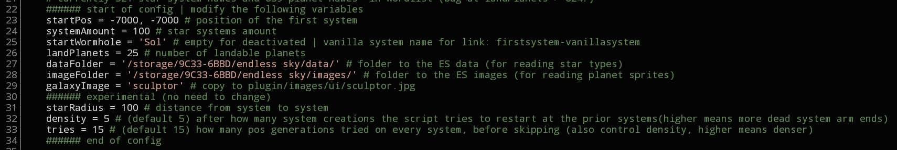
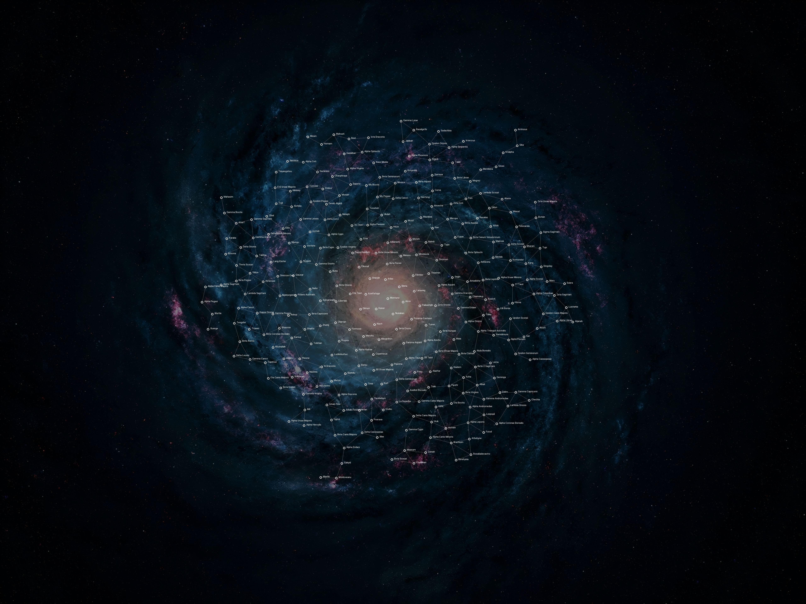

# ES_script_generate_galaxy.py
 
 
This script generates a whole galaxy with up to 500 starsystems (with asteroids, systemlinks, suns, planets, up to 500 landable uninhabited planets). Also a wormhole from a vanilla system of your choice to the first created new system is generated. 
This script has a config section to change the relevant values. It needs access to the ES data and image folder, to read out suns, planet sprites and landing images. 

 
It creates 4 files: 
<ul>
<li>MapGenStuff.txt - the wormhole script</li>
<li>MapGenPlanets - all landable planets</li>
<li>MapGenSystems - all system scripts</li>
<li>MapGenMap.jpg - a map, just to how the result looks like.</li>
</ul>
Here is an example with 300 star systems 

(click to enlarge)

