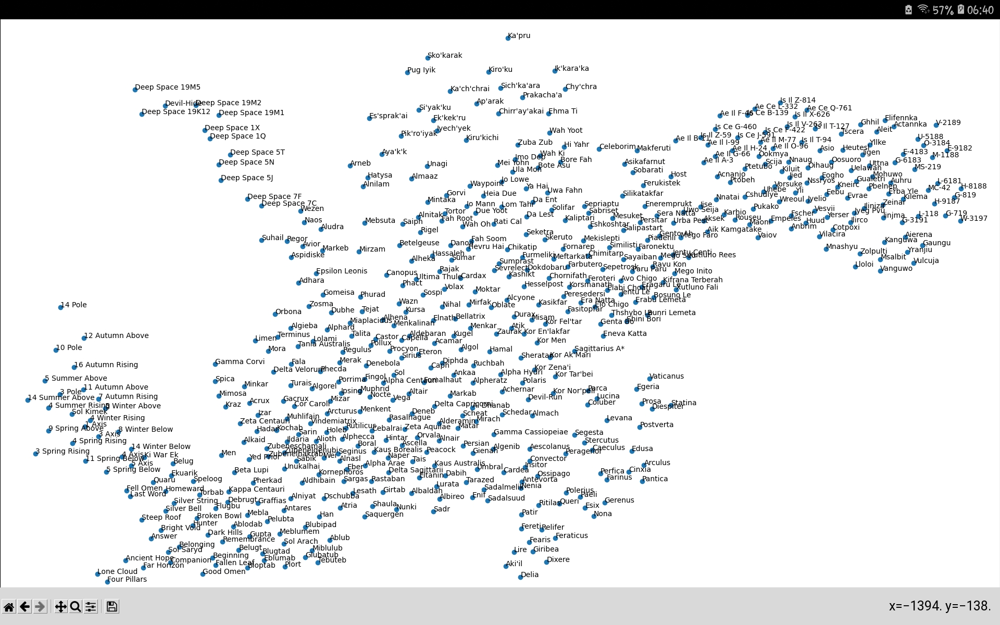
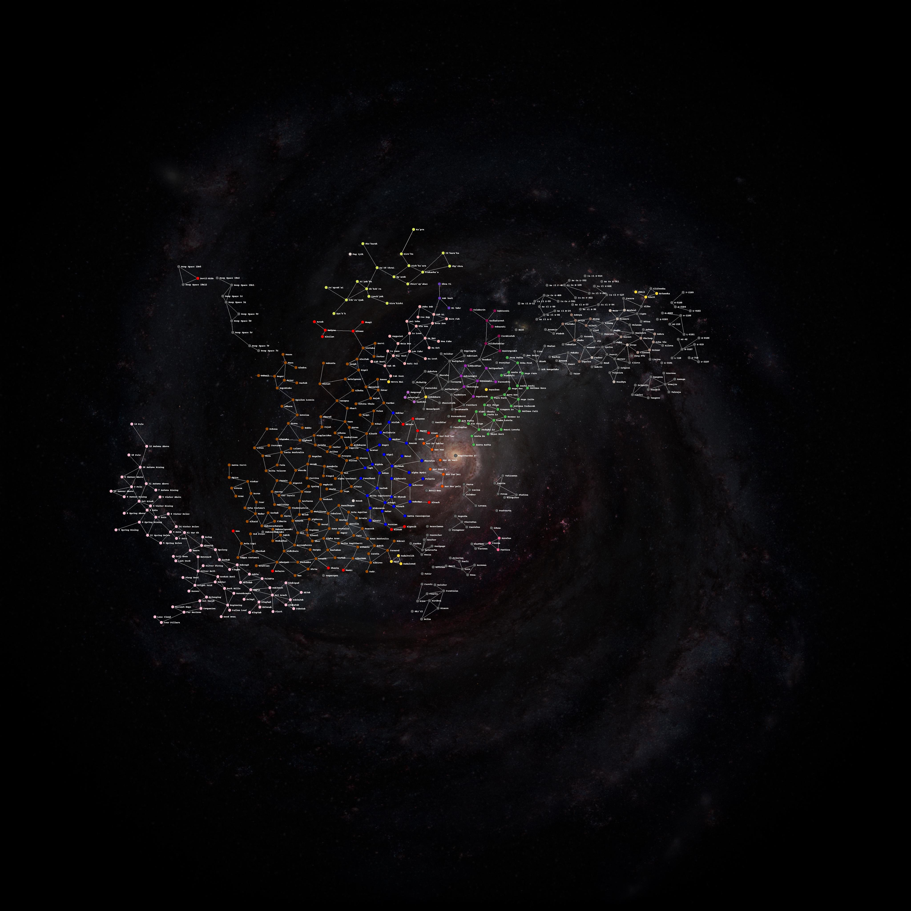

# system map viewer.py
 
Very basic system map viewer written in python. 
Script comments explain use. On click it shows the position 
 

 
 
# pillow.py
 
Improved version. It creates a jpg of the system map. 
WIP its missing wormhole links, and a better design. 
 

